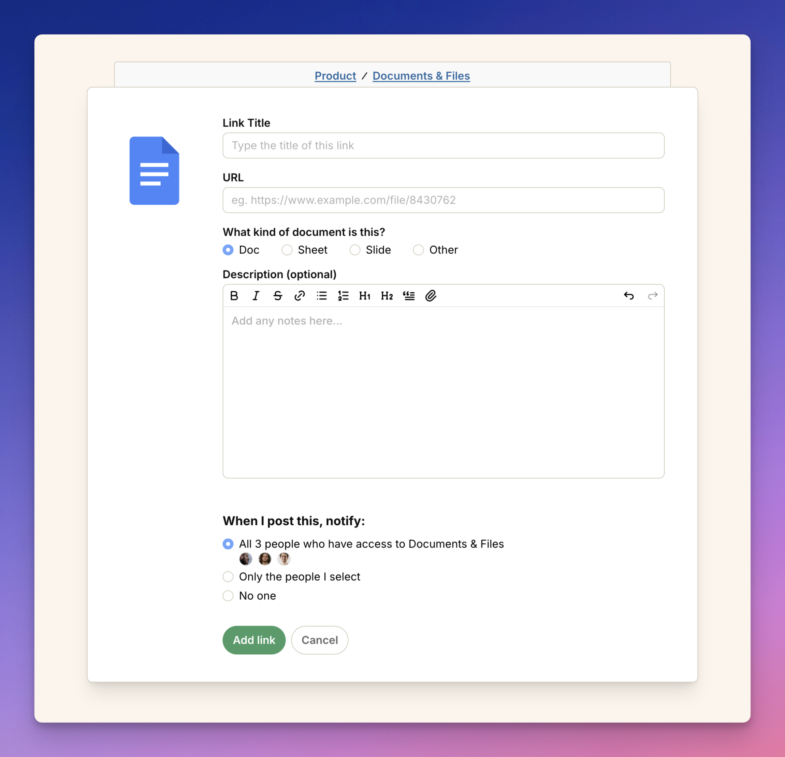

import ImageEnhancer from '@/components/ImageEnhancer.astro';
import { Steps } from '@astrojs/starlight/components';

<ImageEnhancer />

Anyone in a space can add an external link.

To add a link:

<Steps>
1. Open the space where you want to share the link.
2. Click on the **Documents & Files** tool.
2. Click the **Add** button in the top left corner.
3. Select **Add Link**.
4. Choose the service you want to link to or choose **Other** to add a custom link.
5. Enter a name for the link, the URL, and add an optional description.
6. Click **Add link** to save.
</Steps>

Members of the space will be notified that a new file was added. 
