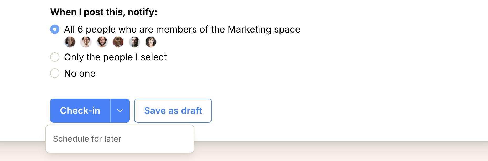

import { Steps, Aside } from '@astrojs/starlight/components';
import ImageEnhancer from '@/components/ImageEnhancer.astro';

<ImageEnhancer />

Check-ins are monthly progress updates that champions provide on their goals. They include status updates, target progress, and narrative updates about wins, obstacles, and needs.

## Monthly check-ins

Operately prompts [champions](/help/assign-goal-champion) to check-in at least once per month. This ensures regular progress tracking and keeps [reviewers](/help/assign-goal-reviewer) informed about goal status.

## Providing a check-in

<Steps>
1. Open the goal page and go to the **Check-Ins** tab
2. Click **Check-In Now** to start a new check-in
3. Update the goal status (On track, Caution, or Off track)
4. Update target values with current progress
5. Add narrative updates about key wins, obstacles, and needs
6. Choose who to notify about the check-in
7. Click **Check-in** to submit
</Steps>

<Aside>
While writing your check-in, click **Show previous check-in** to read the latest update inline.
</Aside>

## Schedule a check-in

Use **Schedule for later** to prepare a goal check-in now and publish it at a future date and time.

<Steps>
1. Open the posting options and choose **Schedule for later**.

2. Select a **date** and **time**.
3. Click **Confirm** to save the check-in.
</Steps>

The scheduled time uses your configured timezone and must be in the future. Until it publishes, you can reopen the check-in to edit the content or change the publish date. You can also choose the options **Publish now** or **Save as draft**.

## Save a draft

If the check-in is not ready to publish, use **Save as draft** instead of submitting. Drafts are labeled **Draft** and only you can see them until you publish.

Each goal can have only one draft check-in at a time. **Save as draft** creates it; every later save updates that same draft rather than starting a second one.

Reopen a draft from the **Check-Ins** tab. On the draft page, use the **...** menu to **Edit** or **Discard draft**. While editing, click **Save draft** to save your changes or **Submit check-in** to publish.

## Goal status

All newly created goals start with a 'pending' status. Once you submit your first 
check-in, you can choose from these status options:

**On track** — Progressing as planned. No blockers.

**Caution** — Emerging risks or delays. Reviewer should be aware.

**Off track** — Significant problems affecting success. Reviewer's help is needed.

## Target updates

Update the current values for each target to reflect actual progress. Target updates should happen continuously as progress is made, not just during monthly check-ins.

## Narrative updates

Use the rich text editor to provide context about:

**Key wins** — Successful milestones, positive outcomes, and achievements.

**Obstacles** — Challenges, blockers, or issues that need attention.

**Needs** — Resources, support, or decisions needed to move forward.

## Reviewer acknowledgment

After submitting a check-in, an eligible reviewer or champion can explicitly acknowledge it by clicking **Acknowledge this Check-In**. This ensures the update has been seen and acknowledged.

## Additional check-ins

While monthly check-ins are required, you can submit additional check-ins anytime significant progress is made or when urgent updates are needed.

## Continuous target updates

Don't wait for monthly check-ins to update target values. Update them continuously as you make progress to keep the goal's progress bar accurate and up-to-date.
