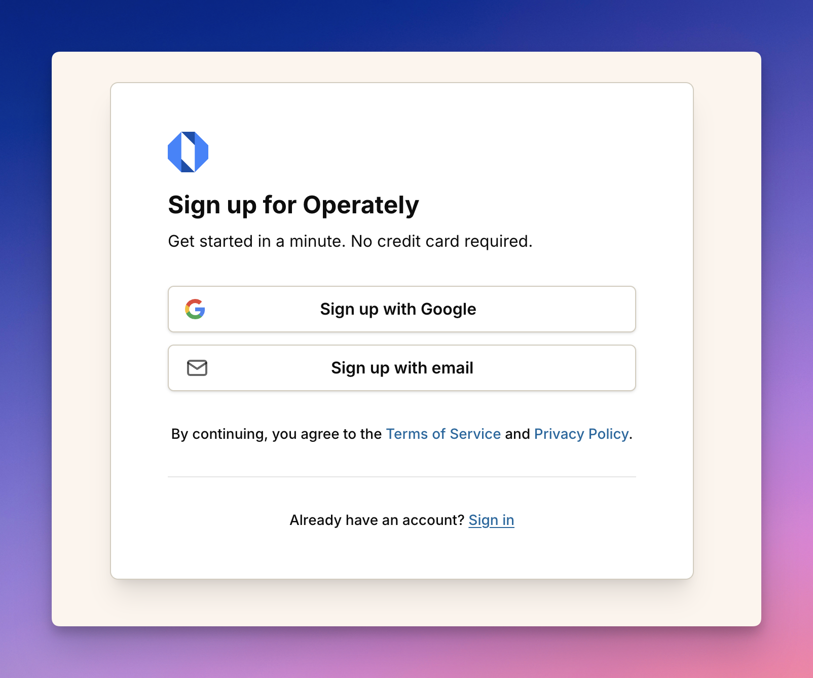
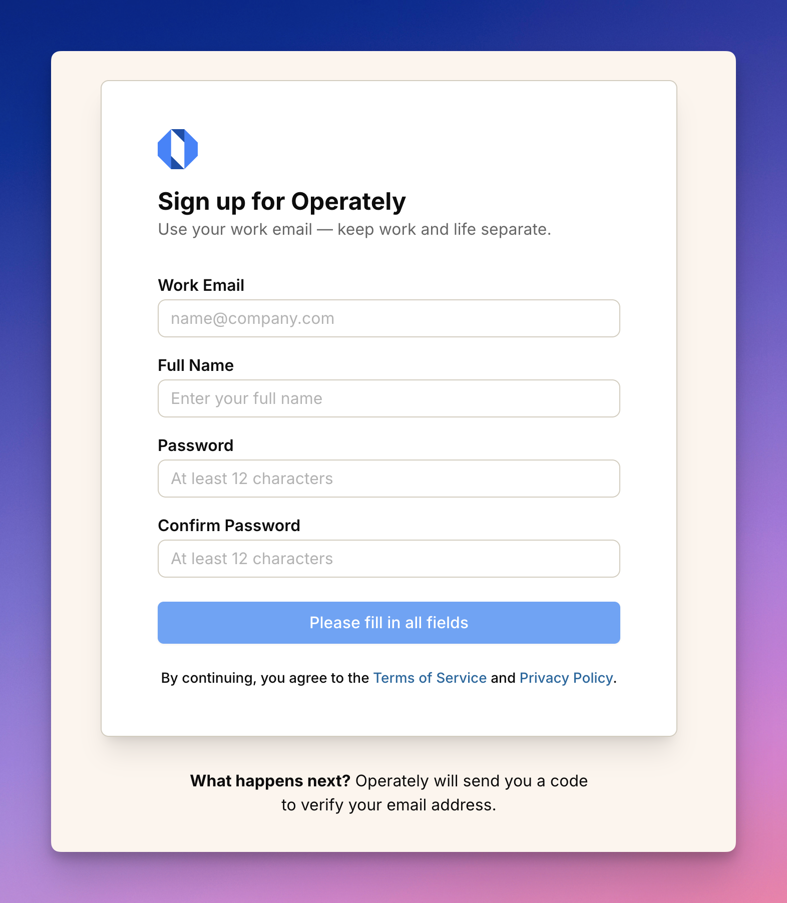

import ImageEnhancer from '@/components/ImageEnhancer.astro';
import { Steps } from '@astrojs/starlight/components';

<ImageEnhancer />

Creating an account in Operately is quick and straightforward. There are two ways to sign up, depending on whether you're using the cloud version or self-hosting Operately.

### Sign up for Operately Cloud

To create a new account on Operately Cloud:

1. Visit [app.operately.com/sign_up](https://app.operately.com/sign_up) or click the main sign up button on the Operately website.

2. Choose your preferred sign-up method:

   - **Sign up with Google**: Click the "Sign up with Google" button for a fast and secure sign-up using your existing Google account. This option will access your Google profile information, including your name, email, and profile picture.

   - **Sign up with email**: Click the "Sign up with email" button to create an account using your work email address.

#### If signing up with email

To create an account with your email:

<Steps>

1. Enter your work email address, full name, and create a password (minimum 12 characters).

2. Click **Continue** to proceed.

3. Check your email for a 6-character verification code sent from `notifications@operately.com`.

4. Enter the code on the verification screen to complete your account creation.

5. If you don't see the email in your inbox, check your spam folder.

</Steps>

### Sign up for self-hosted Operately

If your organization is self-hosting Operately:

1. Navigate to your organization's Operately instance URL.

2. On the sign-up page, enter your work email address, full name, and create a secure password.

3. Complete the verification process by entering the code sent to your email.

## What happens after signing up?

After creating your account, you'll either:

- Join an existing organization (if you were invited)
- Have the option to create a new organization 

Either way, you'll be ready to start collaborating with your team, setting goals, and tracking projects all in one place.
