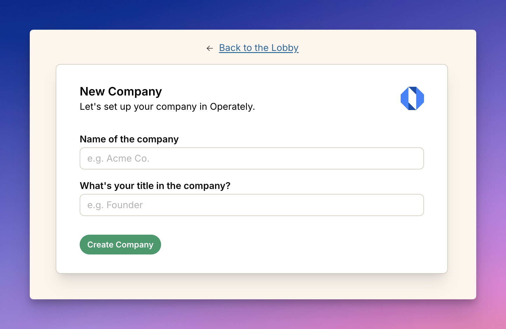
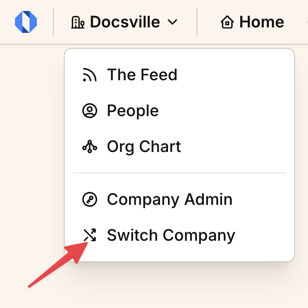

import ImageEnhancer from '@/components/ImageEnhancer.astro';
import { Steps } from '@astrojs/starlight/components';

<ImageEnhancer />

You can create a new organization in Operately either as a new user or when you're already using the system with another organization.

### Creating your first organization

When you sign up for Operately for the first time, you'll automatically be prompted to create a new organization:

<Steps>

1. After completing the account creation process, you'll see a welcome screen with a prompt to create a new organization.

2. Enter your company name in the **Name of the company** field.

3. Enter your job title in the **What's your title in the company?** field.

4. Click the **Create Company** button to set up your organization.

</Steps>

Your new organization will be created instantly, and you'll be taken to your company home page where you can start adding spaces, team members, and setting up your workflow.

### Creating additional organizations

If you already have an Operately account and want to create another organization:

<Steps>

1. Click on your company name in the top navigation bar to open the company menu dropdown.

2. Select **Switch Company** from the dropdown menu.

3. This takes you to the Lobby screen where you can see all your organizations.

4. Click **Create New Company** or a similar option.

5. Enter your new company name and your title in the organization.

6. Click **Create Company** to finish.

</Steps>

## What happens next

After creating your organization:

- You'll automatically become the organization's owner
- A default "Company" [space](/help/intro-to-spaces) will be created
- You can immediately start inviting team members
- You can customize your organization structure by [creating additional spaces](/help/create-space)

Now that your organization is set up, consider [inviting team members](/help/invite-team-member) to get started collaborating.
