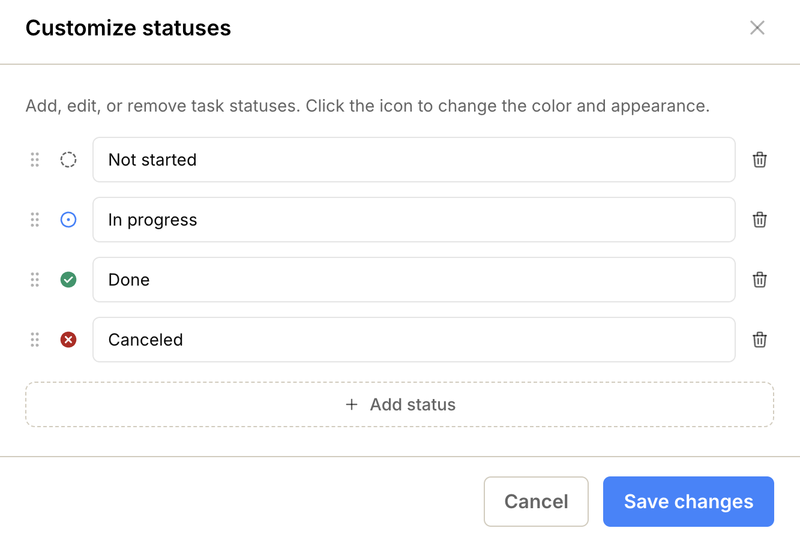

import { Steps, Aside } from '@astrojs/starlight/components';
import ImageEnhancer from '@/components/ImageEnhancer.astro';
import { CogIcon } from '@/components/Icons.jsx';

<ImageEnhancer />

Operately allows you to customize task statuses on a per-project basis. This gives you the flexibility to define a workflow that best fits your team's specific needs for each project.

## Accessing status settings

To begin customizing statuses:

<Steps>
1. Navigate to the **Project** page.
2. Click on the **Tasks** tab.
3. Click the <CogIcon className="text-gray-700" style={{ width: '20px', height: '20px', display: 'inline', verticalAlign: 'middle' }} /> icon located in the top-right corner of the tasks view.
4. Select **Manage statuses** from the dropdown menu.
</Steps>

The "Manage Statuses" form will open, allowing you to add, edit, reorder, or delete statuses.

## Adding a new status

You can create custom statuses to represent different stages of your workflow.

<Steps>
1. Click the **Add status** button.
2. Select a **color/icon** that best represents the new status.
3. Enter a **name** for the status.
4. Click **Save changes**.
</Steps>

## Editing an existing status

You can modify any existing status to better suit your terminology or visual preferences.

<Steps>
1. Locate the status you want to edit.
2. Click on the status **icon/color** and select the appropriate option.
3. Enter a new **name** for the status.
4. Click **Save changes**.
</Steps>

## Reordering statuses

The order of statuses in this list determines how they appear in dropdowns and kanban boards.

<Steps>
1. Click and hold the **drag handle** (six dots) to the left of the status.
2. Drag the status and drop it in the desired position.
3. Click **Save changes**.
</Steps>

## Deleting a status

You can remove statuses that are no longer needed.

<Steps>
1. Click the **bin icon** to the right of the status you wish to delete.
2. Existing tasks might be using this status, so you will be prompted to select a **replacement status**.
3. Click **Save changes**.
</Steps>

<Aside type="note">
When deleting a status that is currently in use, all tasks assigned to that status will be automatically moved to the new status you select. This ensures no tasks are left without a defined state.
</Aside>
