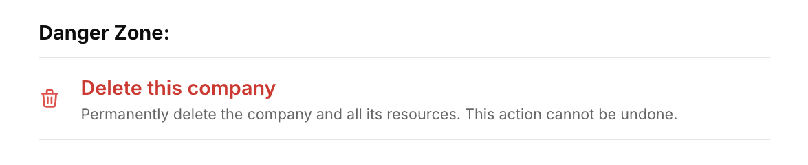
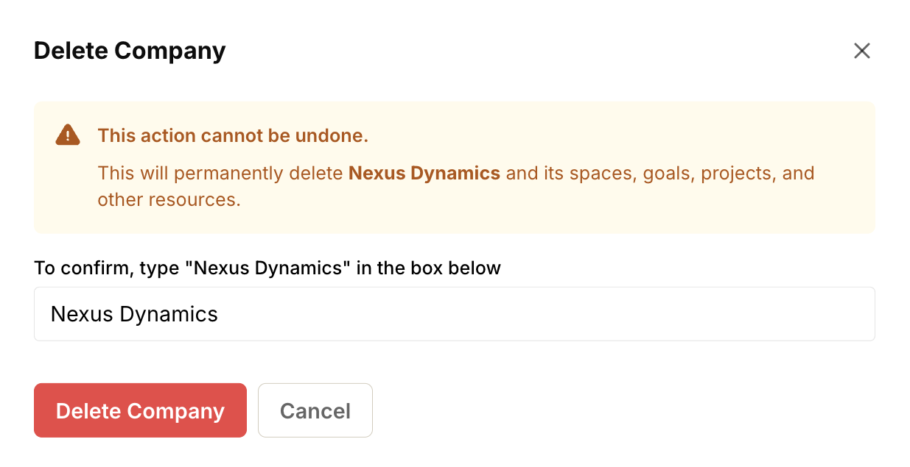

import { Steps } from '@astrojs/starlight/components';
import { Aside } from '@astrojs/starlight/components';
import ImageEnhancer from '@/components/ImageEnhancer.astro';

<ImageEnhancer />

Deleting a company is a permanent action that cannot be undone. It removes the company and all associated data, including spaces, projects, goals, tasks, and discussions.

<Aside type="danger" title="Warning">
  This action is irreversible. Once you delete a company, all data will be permanently lost and cannot be recovered.
</Aside>

## How to delete a company

<Steps>
1. Click on your company name in the top navigation bar to open the company menu.
2. Select **Company Admin** from the dropdown menu.
3. Scroll down to the **Danger Zone** section.
4. Click **Delete this company**.

5. Read the warning message carefully to ensure you understand the consequences.
6. Enter the name of the company in the confirmation field.
7. Click the **Delete company** button to confirm.

</Steps>

<Aside>
  Only administrators can delete the company.
</Aside>
