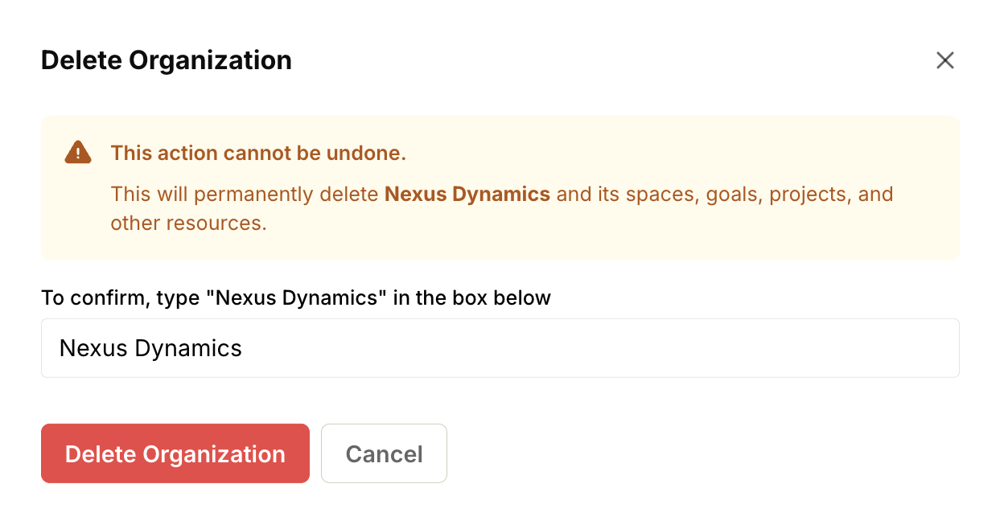

import { Steps } from '@astrojs/starlight/components';
import { Aside } from '@astrojs/starlight/components';
import ImageEnhancer from '@/components/ImageEnhancer.astro';

<ImageEnhancer />

Deleting an organization is a permanent action that cannot be undone. It removes the organization and all associated data, including spaces, projects, goals, tasks, and discussions.

<Aside type="danger" title="Warning">
  This action is irreversible. Once you delete an organization, all data will be permanently lost and cannot be recovered.
</Aside>

## How to delete an organization

<Steps>
1. Click on your organization name in the top navigation bar to open the company menu.
2. Select **Company Admin** from the dropdown menu.
3. Scroll down to the **Danger Zone** section.
4. Click **Delete this organization**.

5. Read the warning message carefully to ensure you understand the consequences.
6. Enter the name of the company in the confirmation field.
7. Click the **Delete Organization** button to confirm.

</Steps>

<Aside>
  Only administrators can delete the company.
</Aside>
