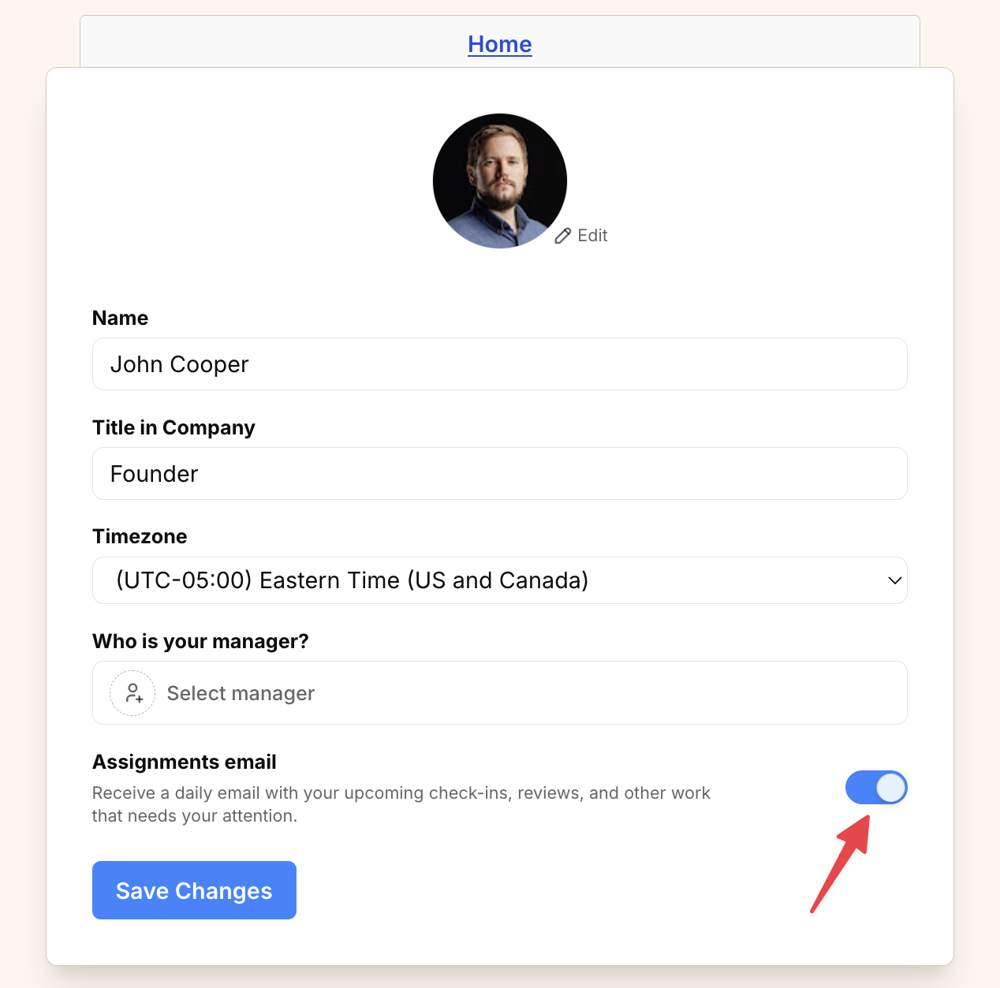

import { Steps } from '@astrojs/starlight/components';
import ImageEnhancer from '@/components/ImageEnhancer.astro';

<ImageEnhancer />

Operately sends a daily email digest summarizing your assigned tasks and updates. If you prefer not to receive these emails, you can disable them in your profile settings.

## How to disable the daily assignments email

<Steps>
1. Click on your avatar or initials in the top-right corner of the screen.
2. Select **Profile** from the dropdown menu.
3. Toggle the **Assignments email** switch to the **Off** position to disable the emails (or **On** to enable them).

4. Click **Save Changes** to apply your preference.
</Steps>
