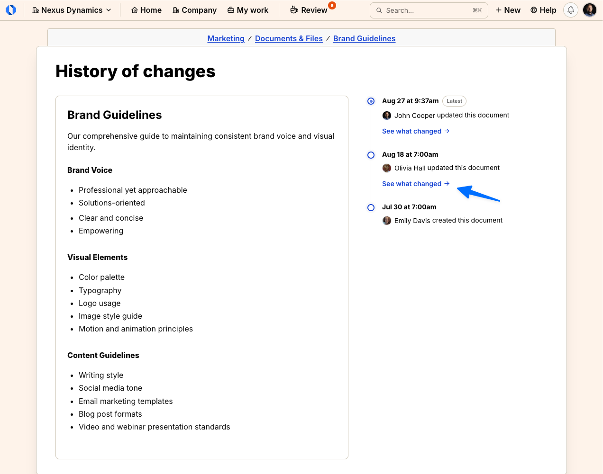
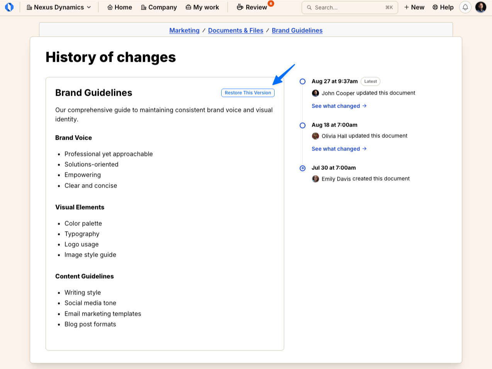

import { Aside, Steps } from '@astrojs/starlight/components';
import ImageEnhancer from '@/components/ImageEnhancer.astro';

<ImageEnhancer />

Published documents keep a history of title and content changes. You can open **History of changes**, compare adjacent versions, and restore an earlier version. Restoring creates a new current version; later versions stay in the history.

Drafts have no history.

## View history

<Steps>
1. Open the document.
2. Click the **...** menu in the top right corner.
3. Select **History of changes**. The page heading is **History of changes**.
4. Select a version in the timeline. The **Latest** badge marks the current version.
5. Review the selected version's title and content on the left.
</Steps>

Anyone who can view the document can open **History of changes**.

## Compare versions

<Steps>
1. On **History of changes**, click **See what changed** on a version in the timeline.
2. Review the **Before** and **After** panes. The legend uses **Removed** and **Added**.
</Steps>

## Restore a version

Restoring requires permission to edit the document. Restores do not notify people.

<Steps>
1. On **History of changes**, select the version you want.
2. Click **Restore This Version**.
3. Confirm on **Restore this version?** The message is: *This replaces the current title and content with the selected version. Later versions will stay in the history.*
4. Click **Restore**. Click **Cancel** to keep the current version.
</Steps>

If someone saved a newer version while you had the page open, Operately shows **Document changed since you opened it**. Click **Reload** and try again.

## Edge cases

<Aside type="caution">
Drafts have no history until the first publish. Copying a document does not copy its history. Restoring a version that matches the current title and content does nothing.
</Aside>

See also [Edit a document](/help/edit-document) and [Export document as Markdown](/help/export-document-markdown).
