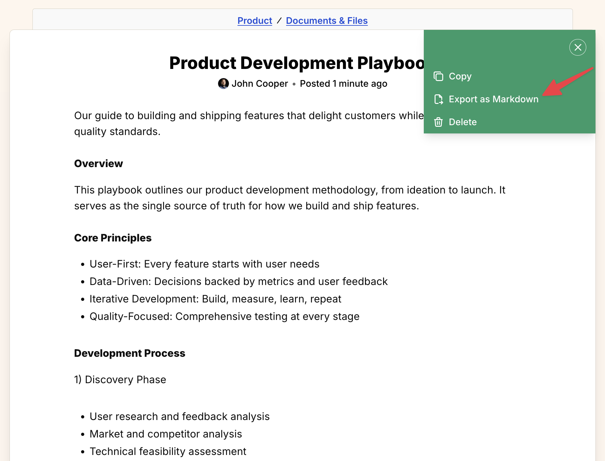
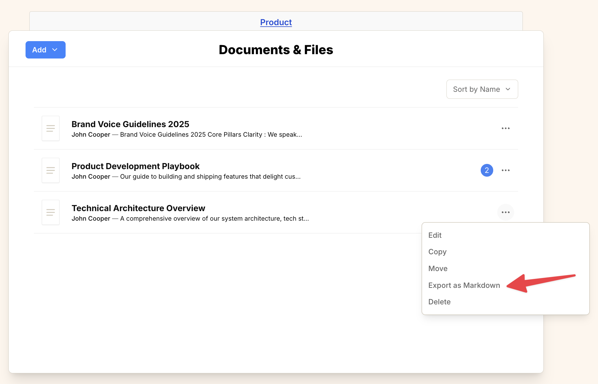

import { Steps } from '@astrojs/starlight/components';
import ImageEnhancer from '@/components/ImageEnhancer.astro';

<ImageEnhancer />

You can easily export your Operately documents to a Markdown file. This is useful for offline access or backups. There are two ways to do this.

## Method 1: From the document page

<Steps>
1. Navigate to the document you want to export.
2. Click the **...** icon located in the top-right corner of the page.
3. Select **Export as Markdown** from the dropdown menu.
</Steps>

## Method 2: From the file list

<Steps>
1. Navigate to the **Documents & Files** tool (or the folder containing the document).
2. Locate the document you want to export in the list.
3. Click the **...** icon on the right side of the document row.
4. Select **Export as Markdown** from the dropdown menu.
</Steps>

In both cases, a Markdown file containing all the document's content will be automatically downloaded to your device.
