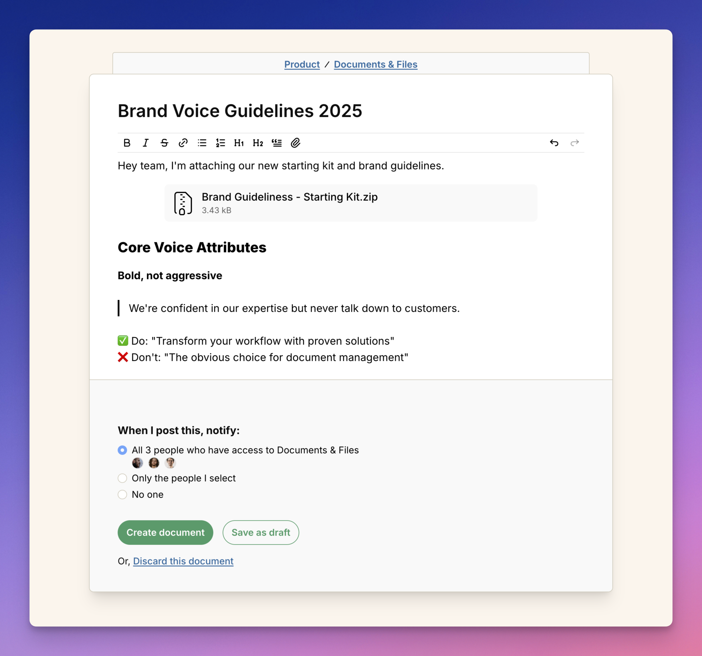

import ImageEnhancer from '@/components/ImageEnhancer.astro';
import { Steps } from '@astrojs/starlight/components';

<ImageEnhancer />

When writing a document, you have several formatting options to make your content 
clear and engaging.

- Make text bold (**example**), italic (*example*), or strikethrough (~~example~~).
- Add numbered or bulleted lists.
- Add headings (H1, H2) to organize your content.
- Quote text to highlight important information.

Tips for writing clear documents: Use headings to break up long content. 
Keep paragraphs short and focused. Use formatting sparingly to avoid 
overwhelming readers.

## Markdown shortcuts

For power users, you can also use Markdown syntax directly in the text editor:

- **Headings**: Use `#` for H1 and `##` for H2
- **Line separator**: Use `---` to create a horizontal line
- **Code blocks**: Use backticks `` `code` `` for inline code
- **Strikethrough**: Use `~text~` to strike through text
- **Quotes**: Use `>` to create blockquotes
- **Highlight**: Use `==text==` to highlight text in yellow

#### Add links to other documents or external websites

You can link to other documents or external websites to provide additional context.

<Steps>
1. Click the link icon in the toolbar.
2. Enter the URL and link text.
3. Click **Add** to insert the link.
</Steps>

#### Embed images, videos, or files

Anywhere you see the text editor in Operately, you can attach a file one of two ways:

##### Option 1: Click the paperclip icon in the toolbar.

<Steps>
1. Click the paperclip icon in the toolbar.
2. Select the file you want to attach.
3. Click **Open** to insert the file.
</Steps>

##### Option 2: Drag and drop the file into the text editor.

<Steps>
1. Drag the file from your computer into the text editor.
2. Drop the file in the green box that appears.
</Steps>
