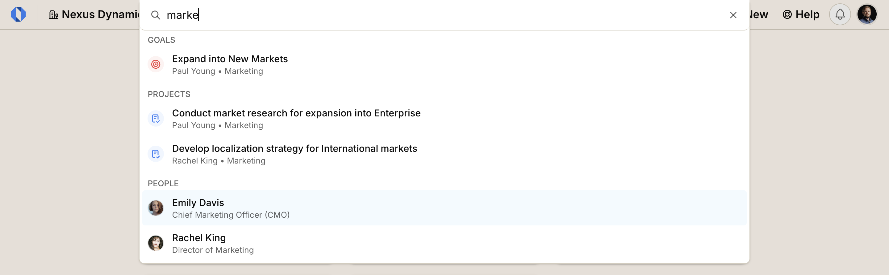

import { Aside } from '@astrojs/starlight/components';
import ImageEnhancer from '@/components/ImageEnhancer.astro';

<ImageEnhancer />

Finding specific goals, projects, milestone, tasks, or people across your organization is effortless with Global Search. The Global Search bar in the navbar lets you search across all resources and get instant results.

## How it works

Start typing in the search bar, and you'll immediately see matching results. The search works across all major resources in Operately:

- **Goals**
- **Projects**
- **Milestones**
- **Tasks**
- **People**

**Click any result** to jump directly to that resource's page

## Shortcuts

You can use keyboard shortcuts to quickly access and navigate the search:

- **Cmd+K** — Open the search bar from anywhere in the application
- **Escape** — Close the search bar 
