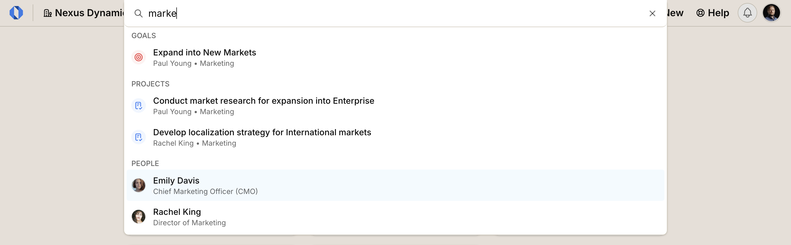
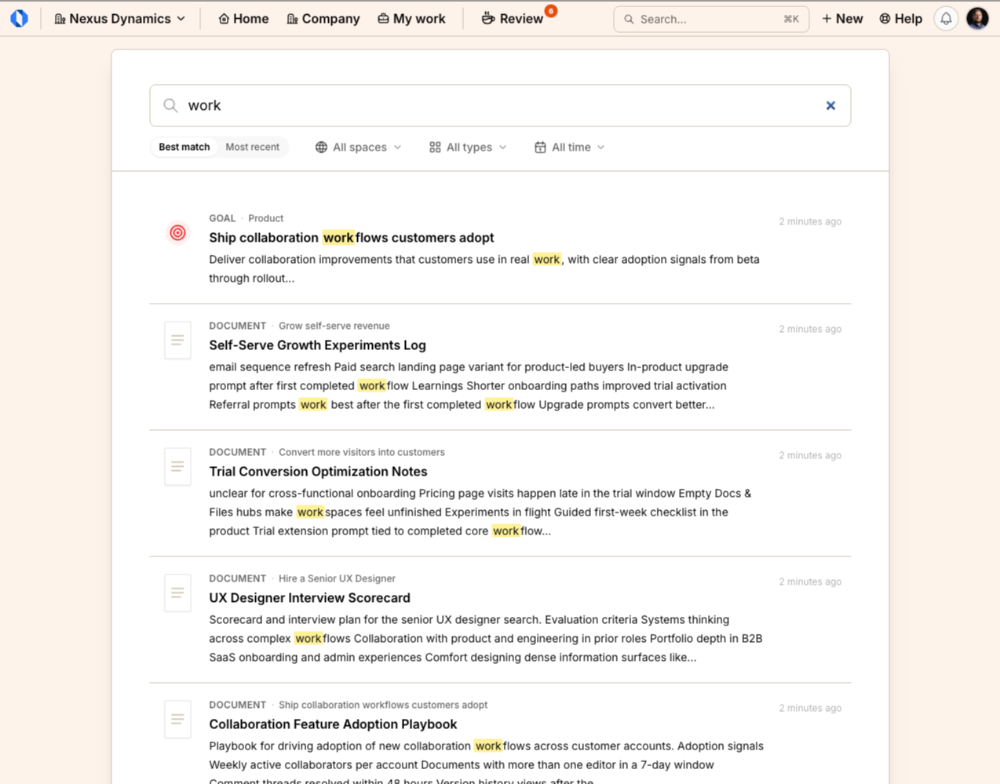

import { Aside } from '@astrojs/starlight/components';
import ImageEnhancer from '@/components/ImageEnhancer.astro';

<ImageEnhancer />

Finding specific goals, projects, milestone, tasks, or people across your organization is effortless with Global Search. The Global Search bar in the navbar lets you search across all resources and get instant results.

## Quick search

Click **Search...** in the navbar, or press **⌘K**, then type at least two characters.

The overlay placeholder is **Search for spaces, projects, goals, milestones, tasks, or people...**

Quick search matches titles and names only. Results are grouped (up to five per type):

- **SPACES**
- **GOALS**
- **PROJECTS**
- **MILESTONES**
- **TASKS**
- **PEOPLE**
- **DISCUSSIONS**
- **FOLDERS**
- **DOCUMENTS**
- **FILES**
- **LINKS**

Click a result to open it. If there are no title matches, the overlay shows **No title or name matches for “work”.**

Quick search does not include closed, completed, or archived work, and it does not search body text.

## Search titles and content

To search titles and content, select **Search all content for “work”** at the bottom of the overlay, which takes you to the search page.

The Search page field is **Search titles and content…**

Refine with:

- **All spaces**
- **All types** — **Projects**, **Goals**, **Milestones**, **Tasks**, **People**, **Discussions**, **Project check-ins**, **Goal check-ins**, **Project retrospectives**, **Documents**, **Folders**, **Files**, **Links**
- **All time** — **Last 7 days**, **Last 30 days**, **Last 90 days**, **Last 12 months**
- Sort: **Best match** or **Most recent**

Full Search includes closed, completed, archived, and paused work, with badges **Closed**, **Completed**, **Archived**, or **Paused**. If nothing matches, it shows **No content found for “work”. Try different keywords.**

You only see results you already have permission to view.

## Search documents and files

On a project or goal **Docs & Files** tab, or in a space's Documents & Files tool, use **Search documents and files…** to search that hub's folders, documents, files, and links.

## Shortcuts

- **Cmd+K** / **Ctrl+K** — Open quick search
- **Escape** — Close the overlay

For the full list of shortcuts, including task navigation, see [Keyboard shortcuts](/help/keyboard-shortcuts).

<Aside>
Type at least two characters. Quick search stays on titles. Use **Search all content for “work”** when you need to search inside documents, discussions, and check-ins.
</Aside>
