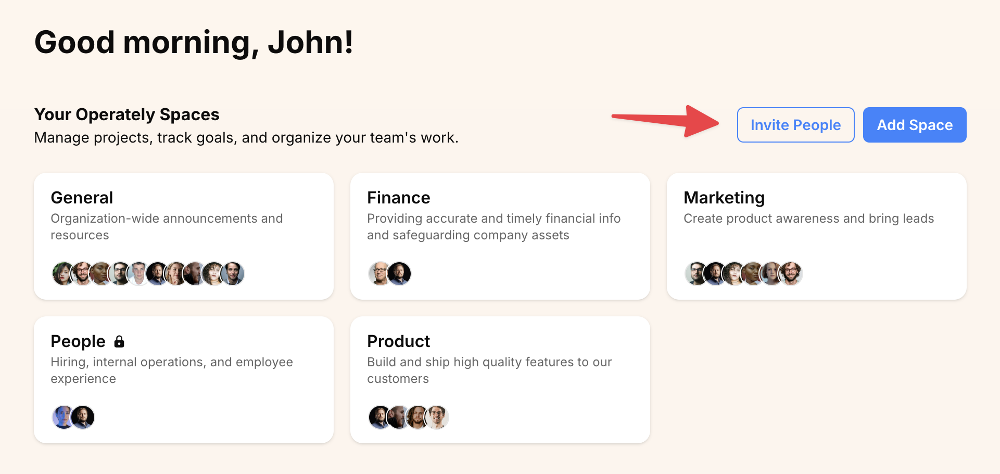
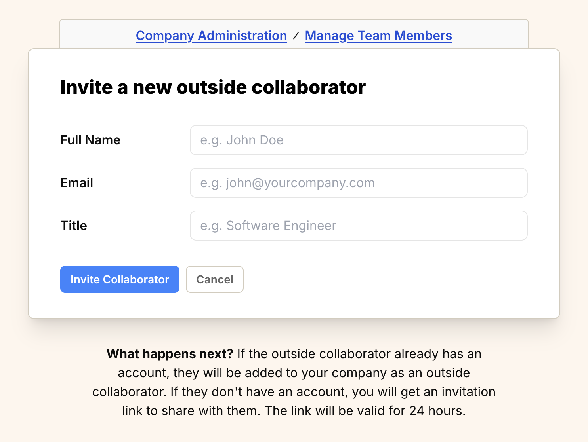

import ImageEnhancer from '@/components/ImageEnhancer.astro';
import { Steps } from '@astrojs/starlight/components';

<ImageEnhancer />

Outside collaborators are people outside your company who need access to specific goals, projects, or spaces. Unlike team members, they don't receive default access to company resources.

## Who can invite outside collaborators?

Company owners and administrators have permission to invite outside collaborators to the organization.

## How to invite an outside collaborator

There are three quick ways to access the invitation form:

### Method 1: Via the Homepage

1. From the homepage, click on **Invite People**.

2. Choose **Outside collaborator**.

### Method 2: Via the "+ New" Button

1. Click the **+ New** button located in the right-hand corner of the top navigation bar.

2. Select **Invite people** from the dropdown menu.

3. Choose **Outside collaborator**.

### Method 3: Via Company Administration

1. Click on your organization name in the top navigation bar in the left-hand corner of your screen to open the company menu.

2. Select **Company Admin** from the dropdown menu.

3. On the **Company Administration** page, find the **Manage Team Members** section and click the **Invite People** button.

4. Choose **Outside collaborator**.

### Filling out the invitation form

After selecting **Outside collaborator**, all methods will take you to the form below:

To invite the outside collaborator:

<Steps>
1. Fill out the form:
    - Enter the outside collaborator's **Full Name**.
    - Enter their work **Email** address.
    - Enter their **Title**.
2. Click the **Invite Collaborator** button.
</Steps>

## Outside collaborators and access

Outside collaborators do not get access to company resources by default. You must give them explicit access to the goals, projects, or spaces they should work on.

## What happens next?

- **If the person already has an Operately account**, they will be added to your organization as an outside collaborator with no default permissions, and they will receive an email notification.

- **If the person does not have an Operately account**, Operately will generate a unique invitation link after you submit the form. Copy and share that link with them so they can join your organization. They'll also receive an email that includes the link.

## Managing pending invitations

While an invitation is waiting for a response, you can manage it from the "Manage Team Members" page.

Find the person you invited:

- **Re-issue Invitation**: If the original invitation link expired or was lost, click the **...** menu next to the person's name and select **Re-Issue Invitation** to generate a new link.
- **Revoke Invitation**: If you need to cancel the invitation before the person accepts, click the **...** menu and select **Revoke Invitation**. This will invalidate the invitation link and remove the pending invitation.
