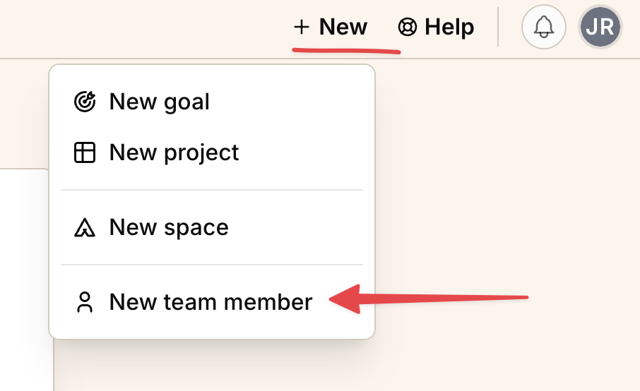
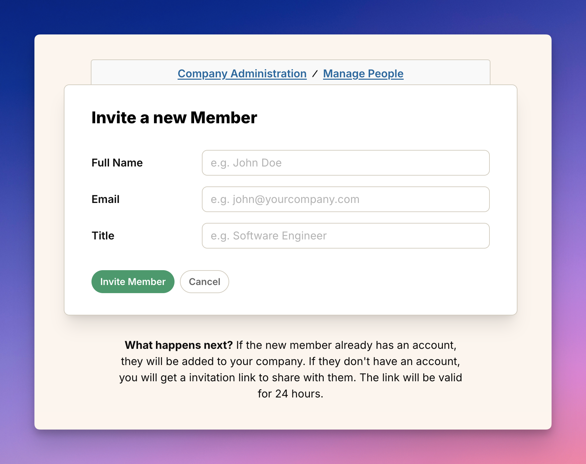

import ImageEnhancer from '@/components/ImageEnhancer.astro';
import { Steps } from '@astrojs/starlight/components';

<ImageEnhancer />

Bringing your team members into Operately is easy and helps everyone stay aligned on goals and projects. Here's how to invite new people to your organization.

## Who can invite team members?

Account owners and administrators have permission to invite new team members to the organization.

## How to invite a new team member

There are two quick ways to access the invitation form:

### Method 1: Via the "+ New" Button

1\. Click the "+ New" button located in the right-hand corner of the top navigation bar.

2\. Select "New team member" from the dropdown menu.

### Method 2: Via Company Administration

1\. Click on your organization name in the top navigation bar in the left-hand corner of your screen to open the company menu.

2\. Select **Company Admin** from the dropdown menu.

3\. On the **Company Administration** page, find the **Manage Team Members** section and click the **Add Team Member** button.

### Filling out the invitation form

Both methods will take you to the "Invite a new Member" form:

To fill out the form and invite the new team member:

<Steps>
1. Enter the team member's **Full Name**.
2. Enter their work **Email** address.
3. Enter their **Title** within the company.
4. Click the **Invite Member** button.
</Steps>

## What happens next?

- **If the person already has an Operately account** using the email address you entered, they will be automatically added to your organization. They'll receive an email notification.

- **If the person does not have an Operately account**, Operately will generate a unique invitation link. You'll need to copy this link and share it with them (e.g., via email or chat). The link is valid for 24 hours.

Once the invited person accepts the invitation or signs up using the link, they will appear in the **Current Team Members** list on the Company Administration page.
