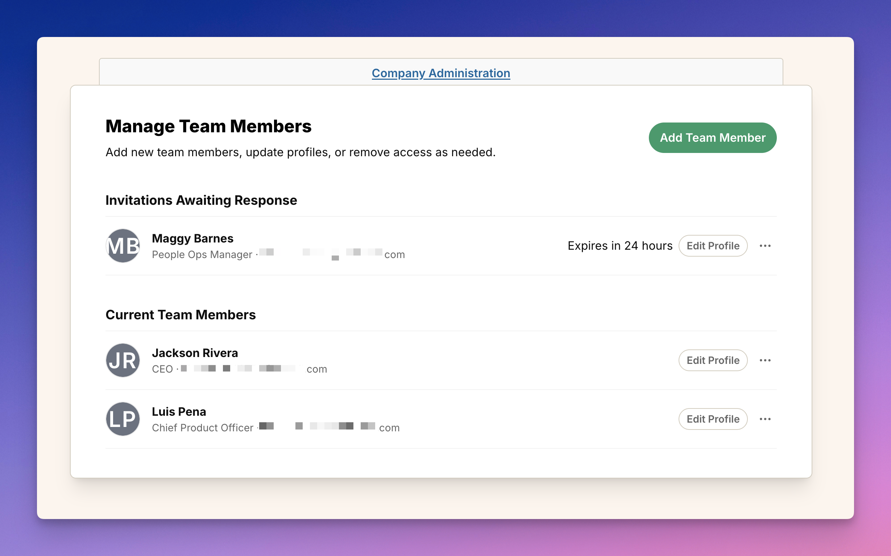

import ImageEnhancer from '@/components/ImageEnhancer.astro';
import { Steps, Aside } from '@astrojs/starlight/components';

<ImageEnhancer />

Bringing your team members into Operately is easy and helps everyone stay aligned on goals and projects. Here's how to invite new people to your organization.

## Who can invite team members?

Account owners and administrators have permission to invite new team members to the organization.

## How to invite a new team member

There are three quick ways to access the invitation page:

### Method 1: Via the Homepage

1. From the homepage, click on **Invite People**.

2. Choose **Team member**.

### Method 2: Via the "+ New" Button

1. Click the **+ New** button located in the right-hand corner of the top navigation bar.

2. Select **Invite people** from the dropdown menu.

3. Choose **Team member**.

### Method 3: Via Company Administration

1. Click on your organization name in the top navigation bar in the left-hand corner of your screen to open the company menu.

2. Select **Company Admin** from the dropdown menu.

3. On the **Company Administration** page, find the **Manage Team Members** section and click the **Invite People** button.

4. Choose **Team member**.

## Managing your Team Invite Link

After selecting **Team member** (using any of the methods above), you will land on the invite team page. On this page, you have full control over how your team joins.

### Enable or disable the link

You can toggle the invite link on or off at any time.

*   **Enabled**: Anyone with access to the link (and meeting the security requirements) can join your organization.
*   **Disabled**: The link will not work, and no one can use it to join.

### Control who can join

You can restrict who is allowed to use the invite link:

*   **Anyone with the link**: Any user who has the link can join your organization.
*   **Trusted email domains only**: Only users with an email address from your trusted domains (e.g., `@yourcompany.com`) can join. This adds an extra layer of security.

<Aside type="tip">
We recommend setting up [Trusted Email Domains](/help/add-trusted-email-domain) and selecting "Trusted email domains only" for the most secure onboarding experience.
</Aside>

### Share the link

Once your link is configured:

1. Click the **Copy** button next to the link URL.
2. Share the link with your team.

### Generate a new link

If you need to revoke access to the current link (for example, if it was shared with the wrong person), you can generate a new one.

1. Click the **generate a new link** text below the link box.
2. This will immediately invalidate the old link and create a new one. Anyone trying to use the old link will no longer be able to join.

## Inviting specific people

If you prefer to invite someone individually:

1. In the **Invite one person?** section, click the **Create invite** button.

2. You will be redirected to the "Invite a new Member" form.

To invite the new team member:

<Steps>
1. Fill out the form:
    - Enter the team member's **Full Name**.
    - Enter their work **Email** address.
    - Enter their **Title**. 
2. Click the **Invite Member** button.
</Steps>

## What happens next?

- **If the person already has an Operately account** using the email address you entered, they will be automatically added to your organization.

- **If the person does not have an Operately account**, Operately will generate a unique invitation link. You'll need to copy this link and share it with them. The link is valid for 24 hours.

While the invitation is pending, the new team member will appear in the **Invitations Awaiting Response** section of the **Manage Team Members** page.

Once the invited person signs up using the link, they will appear in the "Current Team Members" list on the Company Administration page.

## Managing pending invitations

While an invitation is waiting for a response, you can manage it from the "Manage Team Members" page in the Company Administration section.

Find the person in the **Invitations Awaiting Response** section:

- **Re-issue Invitation**: If the original invitation link expired or was lost, click the **...** menu next to the person's name and select **Re-Issue Invitation** to generate a new 24-hour link.
- **Revoke Invitation**: If you need to cancel the invitation before the person accepts, click the **...** menu and select **Revoke Invitation**. This will invalidate the invitation link and remove the pending invitation.
