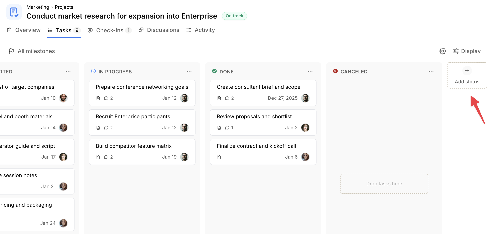
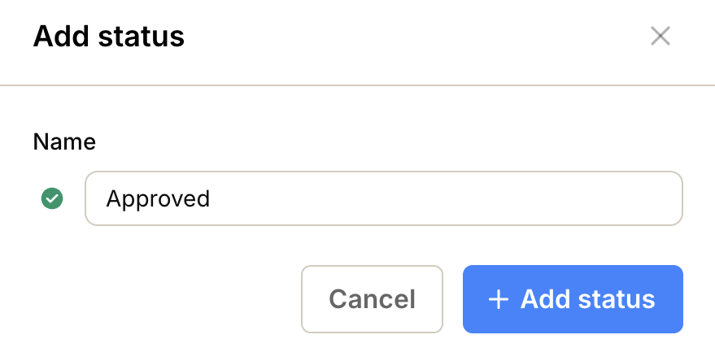
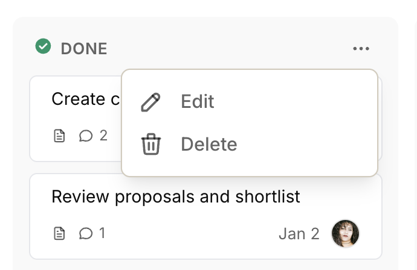
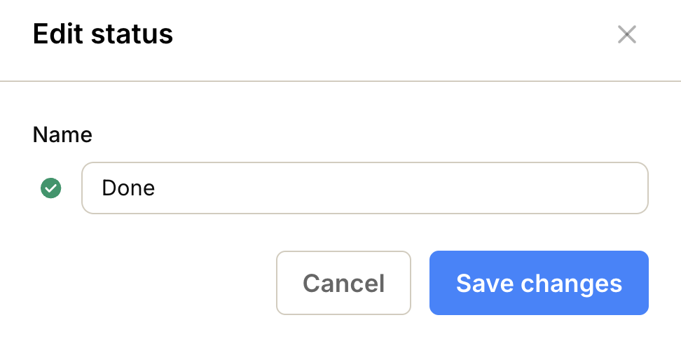
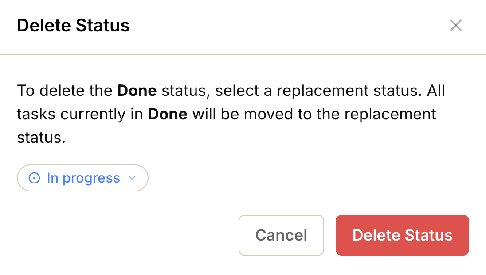

import { Steps, Aside } from '@astrojs/starlight/components';
import ImageEnhancer from '@/components/ImageEnhancer.astro';

<ImageEnhancer />

In the Kanban board, each status is represented as a column. You can customize statuses directly from the board.

## Add a new status

<Steps>
1. Click the **Add status** button to the right of the last status column.

2. Select an **icon** and **color** that best describes the new status.
3. Enter a **name** for the status.
4. Click **Add status**.

</Steps>

## Edit an existing status

<Steps>
1. Click the **...** icon in the top-right corner of the status column.
2. Select **Edit**.

3. Select a new **icon** and **color** that best describes the status.
4. Enter the new **name**.
5. Click **Save changes**.

</Steps>

## Delete a status

<Steps>
1. Click the **...** icon in the top-right corner of the status column.
2. Select **Delete**.

3. Select a **replacement status**.
4. Click **Delete Status**.

</Steps>

<Aside type="note">
All tasks that had the deleted status will be updated to the replacement status you select.
</Aside>

## Reorder statuses

Grab the status column at the top, then drag it to the desired position.

<Aside type="tip">
In projects, statuses can also be customized via the **Manage statuses** option. See [Customize project statuses](/help/customize-project-statuses).
</Aside>
