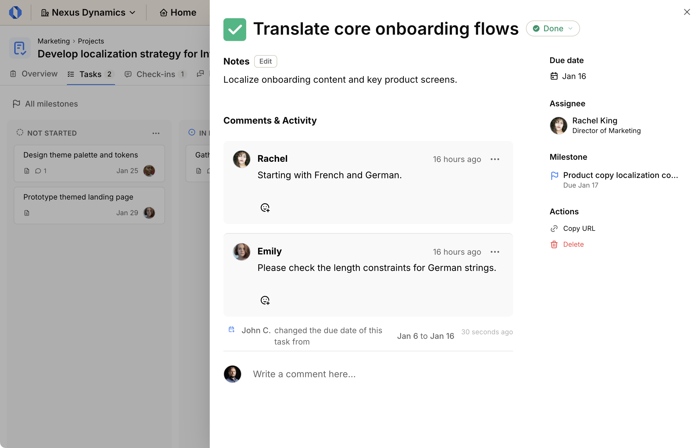

import { Steps, Aside } from '@astrojs/starlight/components';
import ImageEnhancer from '@/components/ImageEnhancer.astro';

<ImageEnhancer />

Clicking a task opens a slide-in view with the task's details. You can open tasks from Kanban boards, project task lists, milestone task lists, and other task views. Use [keyboard shortcuts](/help/keyboard-shortcuts) to move between tasks quickly in supported views.

## Updating task details

You can modify key information directly from the slide-in view:

### Update task name

<Steps>
1. Click on the task's name at the top of the view.
2. Enter the new name.
3. Press **Enter** to save.
</Steps>

### Edit notes

**Add notes:**

<Steps>
1. Click **Add notes about this task...**.
2. Enter your notes.
3. Click **Save**.
</Steps>

**Edit existing notes:**

<Steps>
1. Click the **Edit** button next to the notes.
2. Modify your notes.
3. Click **Save**.
</Steps>

### Edit due date

<Steps>
1. Click **Set due date** (or the current date if one is set).
2. Select the new date from the calendar.
3. Click **Confirm**.
</Steps>

### Edit assignees

Tasks support multiple assignees.

**Assign people:**

<Steps>
1. Click **Assign task**.
2. Select one or more people from the list.
</Steps>

**Change assignees:**

<Steps>
1. Click the current assignee area.
2. Add or remove assignees from the list.
</Steps>

### Reminders

In the sidebar, open **Reminders** and click **Add reminder** to configure timing. The task needs at least one assignee before reminders appear. See [Configure task reminders](/help/configure-task-reminders).

### Edit milestone (Project tasks only)

**Set milestone:**

<Steps>
1. Click **Select milestone**.
2. Choose a milestone from the list.
</Steps>

**Change milestone:**

<Steps>
1. Click the current milestone name.
2. Select **Choose different milestone**.
3. Pick the new milestone from the list.
</Steps>

## Task actions

In the actions section of the slide-in view, you can perform additional operations:

- **Copy link**: Get a direct link to the specific task to share with others.
- **Delete task**: Permanently remove the task from the board.

## Activity and comments

The slide-in view also shows the task's timeline:

- **Timeline**: View a chronological history of all events and changes related to the task.
- **Comments**: Add comments to discuss the task, ask questions, or provide updates to your team.

## Subscriptions

Use the subscription section in the sidebar to manage who receives notifications. See [Subscriptions](/help/subscriptions).
