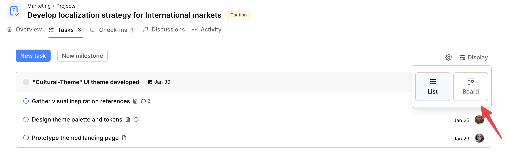
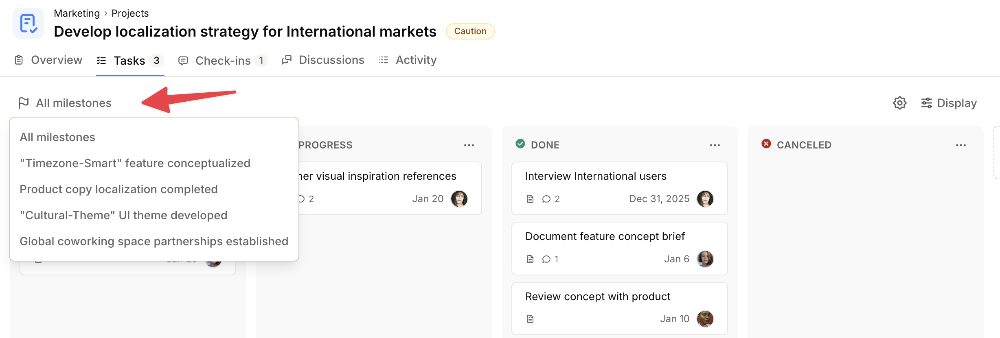

import { Steps, Aside } from '@astrojs/starlight/components';
import ImageEnhancer from '@/components/ImageEnhancer.astro';

<ImageEnhancer />

The Kanban board helps you visualize and manage tasks more easily. It displays tasks as cards organized into columns representing their status, allowing you to track progress at a glance.

The Kanban board is available for both **Space** and **Project** tasks.

## Kanban for Spaces

In Spaces, the Kanban board is available as part of the **Tasks** tool. By default, this tool is disabled, but it can be enabled.

<Aside type="tip">
  See [Space Tools](/help/space-tools) for instructions on how to enable tools in a space.
</Aside>

## Kanban for Projects

In Projects, tasks are shown in the **Tasks** tab in a list view by default. You can easily switch to the Kanban board view.

To switch to Kanban view:

<Steps>
1. Navigate to the **Project** page.
2. Click on the **Tasks** tab.
3. Click the **Display** button in the top-right corner of the page.
4. Select **Board** from the dropdown menu.
</Steps>

Operately remembers your choice. Whenever you access this page, the tasks will be displayed in the Kanban view, until you change it back to List view.

## Filtering by milestone (Projects)

By default, the Kanban board shows tasks from all milestones. In projects, you can filter the board to a single milestone.

To filter tasks by milestone:

<Steps>
1. Click **All milestones** in the top-left part of the screen.
2. Select the milestone you want to view.
</Steps>

Only tasks that belong to the selected milestone will appear on the board.

## Using the Kanban board

In the Kanban board, each status is represented as a column and the tasks are placed in the columns according to their status.

You can drag and drop tasks into a new status or a new place to update a task's status or its position in the Kanban board.
