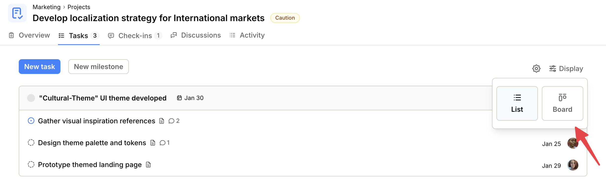
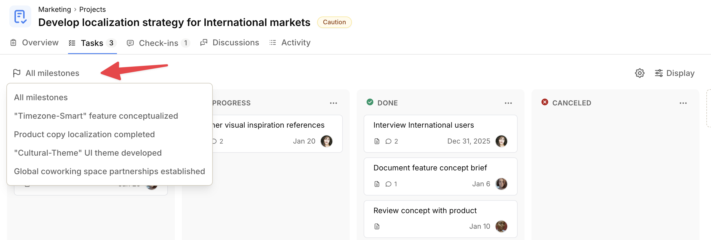

import { Steps, Aside } from '@astrojs/starlight/components';
import ImageEnhancer from '@/components/ImageEnhancer.astro';

<ImageEnhancer />

The Kanban board helps you visualize and manage tasks more easily. It displays tasks as cards organized into columns representing their status, allowing you to track progress at a glance.

The Kanban board is available for both **Space** and **Project** tasks.

## Kanban for Spaces

In Spaces, the Kanban board is available as part of the **Tasks** tool.

<Aside type="tip">
  See [Space Tools](/help/space-tools) for instructions on how to enable tools in a space.
</Aside>

## Kanban for Projects

In Projects, tasks are shown in the **Tasks** tab in a list view by default. You can easily switch to the Kanban board view.

To switch to Kanban view:

<Steps>
1. Navigate to the **Project** page.
2. Click on the **Tasks** tab.
3. Click the **Display** button in the top-right corner of the page.
4. Select **Board** from the dropdown menu.
</Steps>

If you can edit the project, your **List** or **Board** choice is saved for the team. People who cannot edit can still switch locally.

## Filtering by milestone (Projects)

By default, the board shows **All project tasks**. Use **Viewing tasks for** to filter to one milestone, or click **Create milestone**.

To filter tasks by milestone:

<Steps>
1. Click **Viewing tasks for** in the top-left part of the screen.
2. Select **All project tasks** or a milestone name.
</Steps>

Only tasks that belong to the selected milestone will appear on the board.

## Using the Kanban board

In the Kanban board, each status is represented as a column and the tasks are placed in the columns according to their status.

You can drag and drop tasks into a new status or a new place to update a task's status or its position in the Kanban board.

Completed milestones are collapsed by default under **N completed milestone(s)**. Expand that section to see them.
