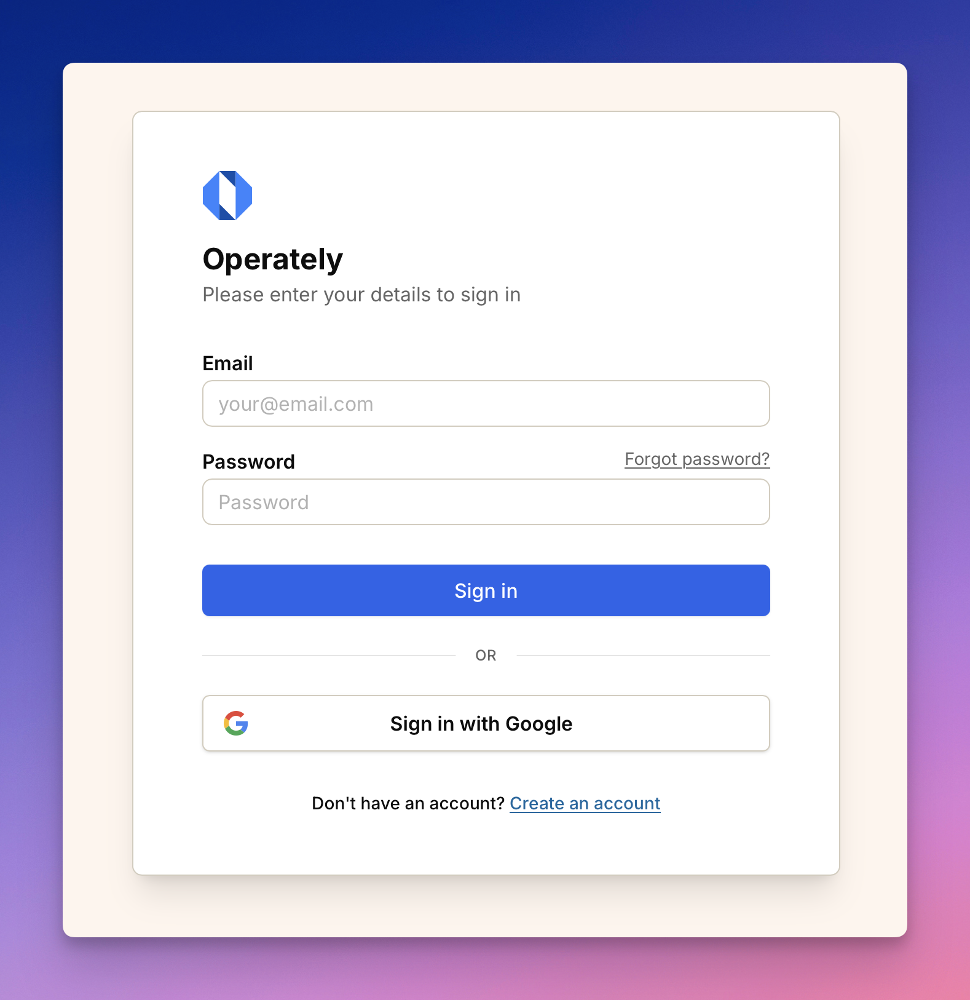

import ImageEnhancer from '@/components/ImageEnhancer.astro';
import { Steps } from '@astrojs/starlight/components';

<ImageEnhancer />

Logging in to Operately takes just a few seconds whether you're using your Google account or email/password. Here's how to get back to your work quickly.

### Log in to Operately Cloud

To log in to Operately Cloud:

1. Visit [app.operately.com/log_in](https://app.operately.com/log_in) or click the "Log in" button on the Operately website.

2. Choose your login method:

   - **Log in with Google**: Click the "Sign in with Google" button if you created your account using Google. Select your Google account from the options that appear and you'll be automatically signed in.

   - **Log in with email**: Click the "Log in with email" button if you created your account using your email address.

#### If logging in with email:

<Steps>

1. Enter the email address you used to create your account.

2. Enter your password.

3. Click **Continue** to access your account.

</Steps>

### Log in to self-hosted Operately

If your organization is self-hosting Operately:

<Steps>

1. Navigate to your organization's Operately instance URL.

2. Enter your email address and password.

3. Click **Continue** to access your account.

</Steps>

## Trouble logging in?

If you're having trouble accessing your account:

- **Forgot your password?** Click the "Forgot password?" link on the login screen and follow the instructions to reset it.

- **Not receiving emails?** Check your spam or junk folder for emails from `notifications@operately.com`.

- **Browser issues?** Try clearing your browser cache or using an incognito/private browsing window.

- **Still having trouble?** Contact your organization's Operately administrator or [Operately team](/contact) for assistance.

## After logging in

Once you've successfully logged in, you'll be taken to your organization's home page where you can:

- See recent activity across your spaces
- Access your spaces, goals, and projects
- Continue working on your documents
- View and respond to notifications

If you belong to multiple organizations, you'll need to select which organization to access after logging in.
