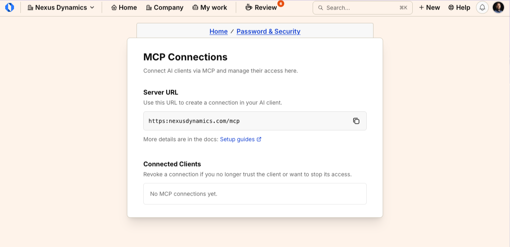
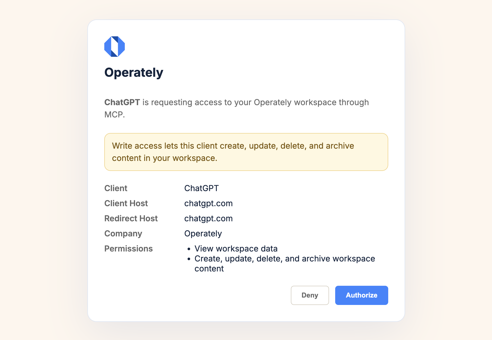

import { Aside, Steps } from '@astrojs/starlight/components';
import ImageEnhancer from '@/components/ImageEnhancer.astro';

<ImageEnhancer />

Use MCP (Model Context Protocol) to connect an AI client such as Claude, ChatGPT, or Cursor to Operately. After you authorize the client, it can search and work with the goals, projects, tasks, and documents you already have access to.

MCP is separate from [API tokens](/help/create-api-token) and the [CLI](/help/cli). Each MCP connection is tied to one company. To use a different company, connect the client again and choose that company.

## How to get there

- Avatar menu → **MCP Connections**
- Avatar menu → **Password & Security** → **MCP connections**

## Connect a client

<Steps>
1. Click your avatar or initials in the top-right corner of the screen.
2. Select **MCP Connections**.
3. Copy the **Server URL**. Use this URL to create a connection in your AI client.
4. In your AI client, add a remote MCP server and paste that URL.
5. Sign in to Operately if the client asks you to.
6. If you belong to more than one company, choose which company to use for this connection, then click **Continue**.
7. Review **Client**, **Company**, and **Permissions**, then click **Authorize**. Click **Deny** if you did not start this connection.
</Steps>

The **Server URL** is `https://app.operately.com/mcp` on Operately Cloud. On a self-hosted installation, it is your instance URL followed by `/mcp`.

If you belong to only one company, Operately selects it automatically and skips the company step.

The authorization screen says the client is requesting access to your Operately workspace through MCP.

You can also open **MCP Connections** from **Password & Security** by clicking **MCP connections** (*Review and revoke AI client connections*).

## Permissions

The client requests access when it connects. Operately shows those permissions on the authorization screen:

- **View workspace data** — the client can read work you already have access to.
- **Create, update, delete, and archive workspace content** — the client can change work in that company.

If the client asks for write access, Operately warns: *Write access lets this client create, update, delete, and archive content in your workspace.*

On the **MCP Connections** page, each connected client shows an **Access** value of **View only**, **Edit only**, or **View and edit**.

<Aside type="note">
If the client does not request write access, Operately grants view access only.
</Aside>

## Review connected clients

The **Connected Clients** section lists every client you have authorized. Revoke a connection if you no longer trust the client or want to stop its access.

Each row shows:

- **Client**
- **Access**
- **Connected**
- **Last Used**

If you have not authorized any clients yet, the page shows **No MCP connections yet.**

## Revoke a connection

Revoking immediately stops that client's access. The client must reconnect through OAuth before it can use Operately again.

<Steps>
1. Open **MCP Connections**.
2. In the **Connected Clients** table, open the menu on the client row.
3. Click **Revoke**.
4. On the **Revoke connection** dialog, click **Revoke**. Click **Cancel** to keep the connection.
</Steps>

The confirmation asks: *Revoke access for [client name]? The client will need to reconnect through OAuth.*

## What to read next

- [Create an API token](/help/create-api-token)
- [Operately CLI overview](/help/cli)
- [Use Operately with OpenClaw](/help/use-with-openclaw)
- [Operately API docs](/help/api)
