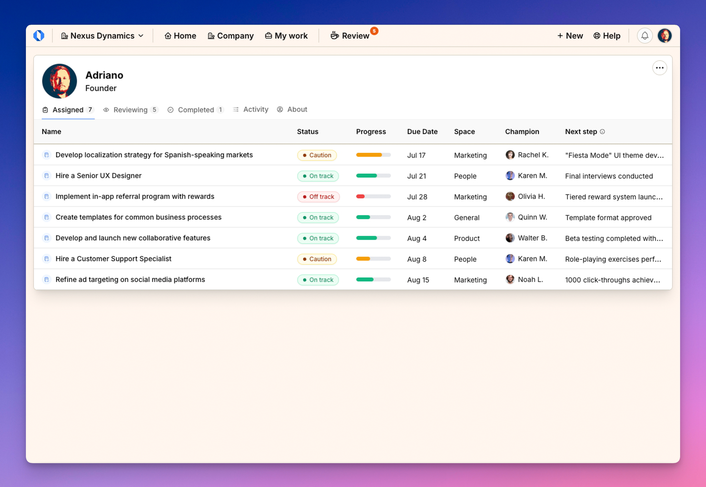

import ImageEnhancer from '@/components/ImageEnhancer.astro';

<ImageEnhancer />

The My Work page is your personal dashboard that provides a centralized view of all your work within Operately. Here, you can track your responsibilities, see what you're reviewing, view your completed work, check your recent activity, and access your profile information.

## Accessing the My Work page

Click on the **My work** option in the top navigation bar to directly open your personal work dashboard.

## Understanding the My Work page layout

When you access the My Work page, you'll see:

- **Page header**: Shows your profile picture, name, and job title.
- **Navigation tabs**: Five tabs that organize your work and information:
  - **Assigned**: Work you own or contribute to
  - **Reviewing**: Work you are responsible for reviewing
  - **Completed**: Work you've finished
  - **Activity**: Your recent actions in the system
  - **About**: Your contact information and organizational relationships

Each tab is designed to help you focus on a specific aspect of your work and responsibilities within the organization.

## Key benefits of the My Work page

- **Centralized tracking**: Quickly see all your responsibilities in one place
- **Task prioritization**: Easily identify what needs your immediate attention
- **Work history**: Access a record of your completed initiatives
- **Personal accountability**: Stay on top of your assignments and reviews
- **Organizational context**: Understand your position within the company structure

The My Work page serves as your personal command center, helping you manage your workflows effectively and maintain visibility into your contributions across the organization.
