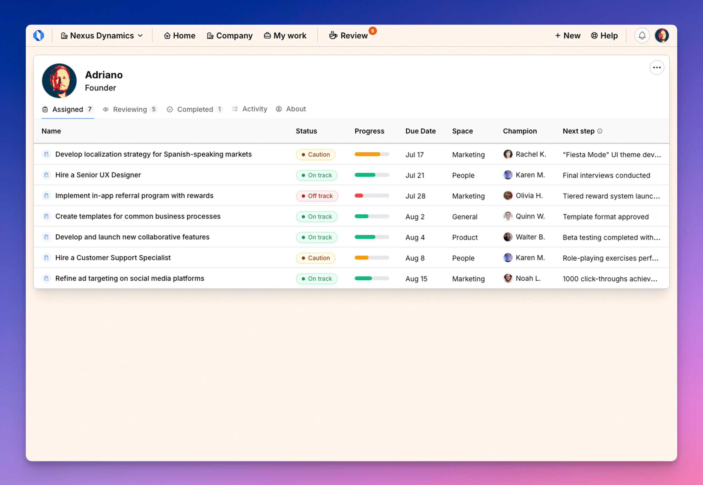
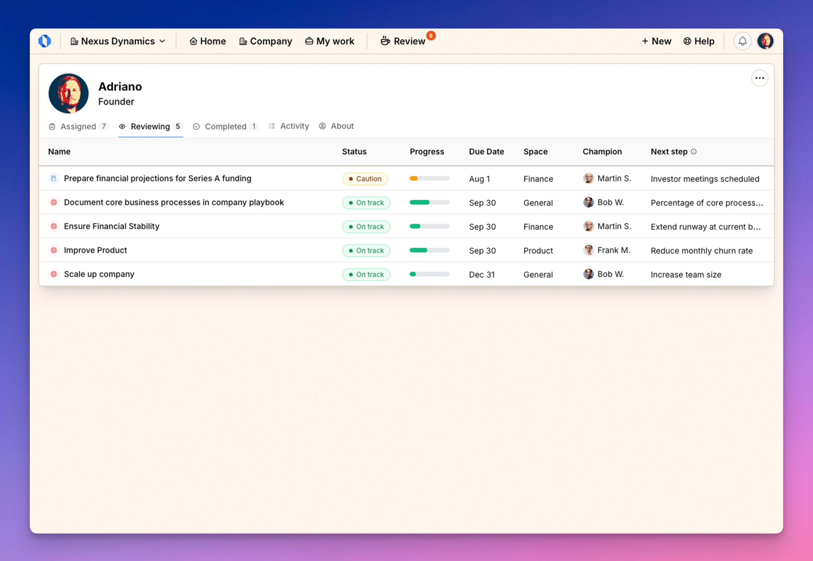
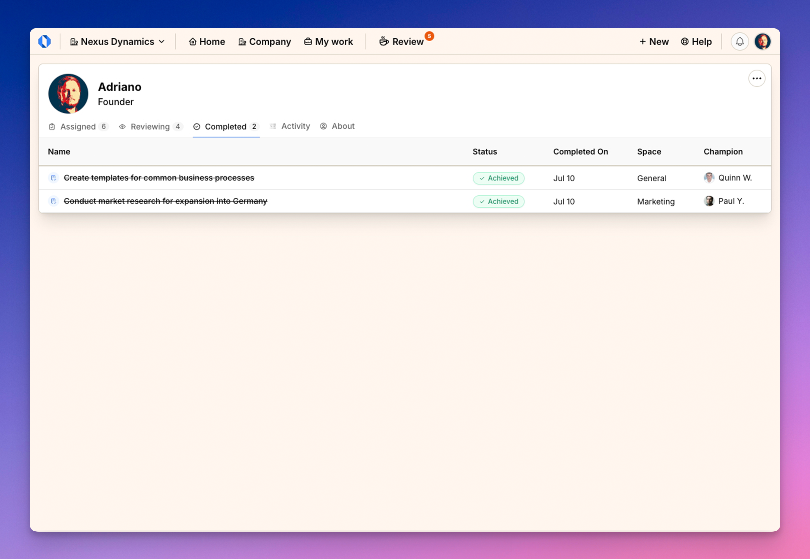
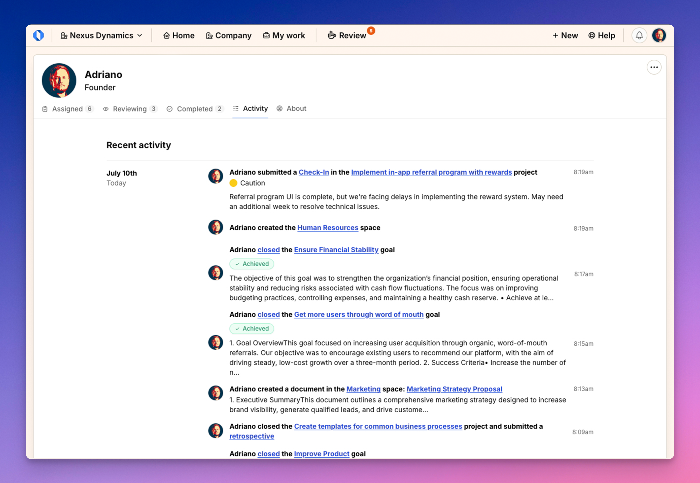
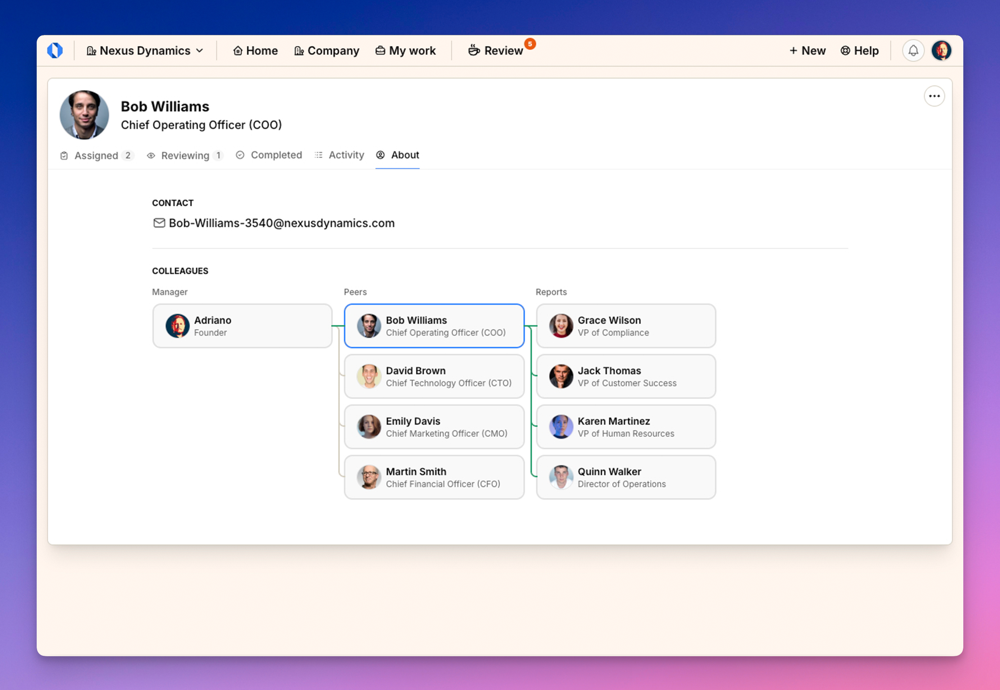

import { Aside } from '@astrojs/starlight/components';
import ImageEnhancer from '@/components/ImageEnhancer.astro';

<ImageEnhancer />

The My Work page is organized into five tabs that help you manage different aspects of your work and profile. Each tab serves a specific purpose to help you stay organized and efficient.

## Assigned Tab

The Assigned tab shows all ongoing goals and projects where you are either the champion or a contributor.

### What you'll see in the Assigned tab:

- **Name**: The title of the goal or project
- **Space**: Which team or department the work belongs to
- **Status**: Current status (On Track, At Risk, Off Track, etc.)
- **Progress**: Visual indicator of completion percentage
- **Due Date**: When the work is scheduled to be completed
- **Owner**: The person responsible (usually yourself or a co-champion)
- **Next Step**: The upcoming action needed for progress

This tab helps you prioritize your current responsibilities and track what needs your attention right now.

## Reviewing Tab

The Reviewing tab displays all goals and projects where you are responsible for reviewing updates from others. This typically includes work from your direct reports or projects where you've been designated as a reviewer.

### What you'll see in the Reviewing tab:

- **Name**: The title of the goal or project
- **Space**: Which team or department the work belongs to
- **Status**: Current status (On Track, At Risk, Off Track, etc.)
- **Progress**: Visual indicator of completion percentage
- **Due Date**: When the work is scheduled to be completed
- **Owner**: The person whose work you're reviewing
- **Next Step**: The upcoming action needed for progress

This tab ensures you don't miss important oversight responsibilities and helps you maintain awareness of work happening on your team.

## Completed Tab

The Completed tab shows all finished goals and projects where you were either the champion or a contributor. It provides a record of your accomplishments and contributions.

### What you'll see in the Completed tab:

- **Name**: The title of the completed goal or project
- **Status**: Final status (Completed, Canceled, etc.)
- **Completed On**: The date when the work was finished
- **Space**: Which team or department the work belonged to
- **Champion**: The person who led the work

This historical view helps you track your achievements and reflect on past work, which can be valuable for performance reviews or planning future initiatives.

## Activity Tab

The Activity tab displays a chronological record of your recent actions and interactions within Operately. This includes updates you've made, comments you've posted, goals or projects you've created, etc.

### What you'll see in the Activity tab:

- A timeline of your recent actions
- Dates and times when activities occurred
- Links to the relevant goals, projects, discussions, or other items
- Brief descriptions of what actions were taken

This tab provides a useful personal audit trail and can help you recall recent work when providing updates or reports.

## About Tab

The About tab displays your personal information and organizational relationships within the company.

### What you'll see in the About tab:

1. **Contact information**:
   - Your email address for communication

2. **Colleagues section**:
   - **Manager**: Your direct supervisor (if applicable)
   - **Peers**: Other team members who share your manager
   - **Direct Reports**: Team members who report to you (if applicable)

The organizational relationship section displays these connections visually, helping you understand your place within the organization's hierarchy.

<Aside>The colleagues section can be particularly helpful for new employees to understand the organizational structure or for anyone looking to identify the right person to contact for specific needs.</Aside>
