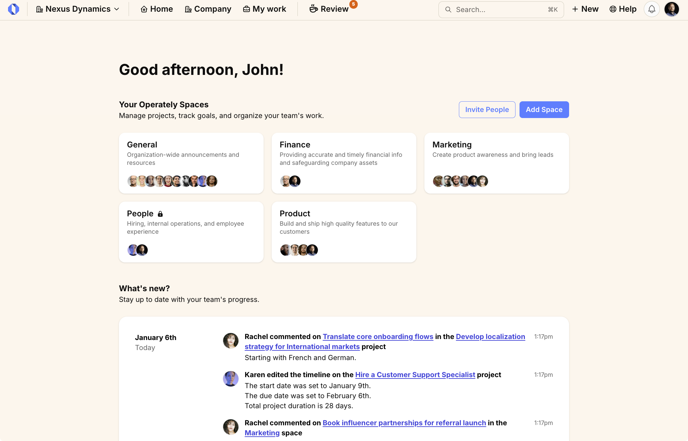
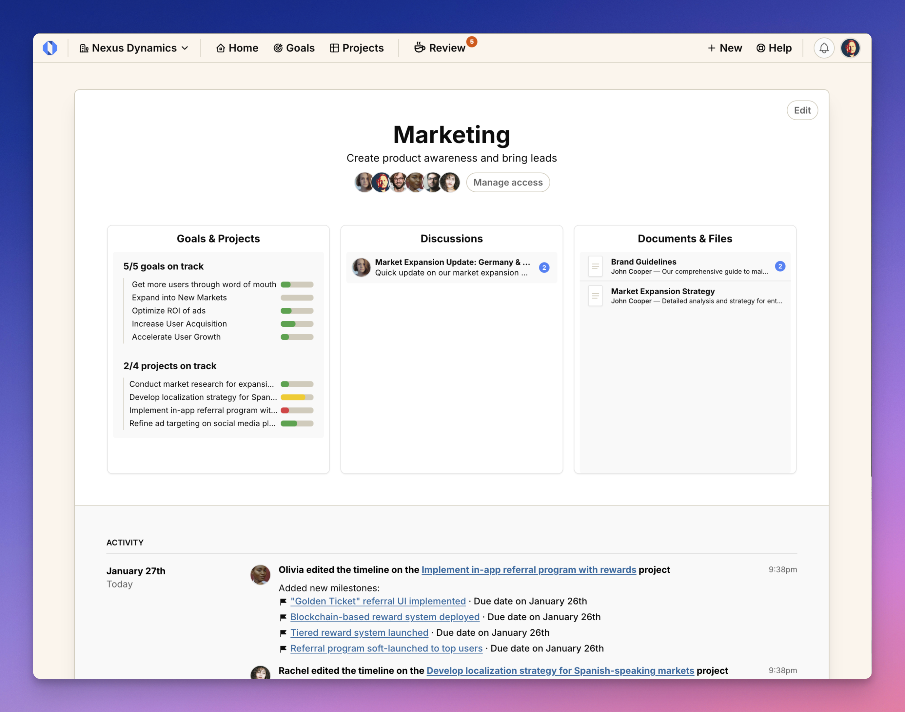
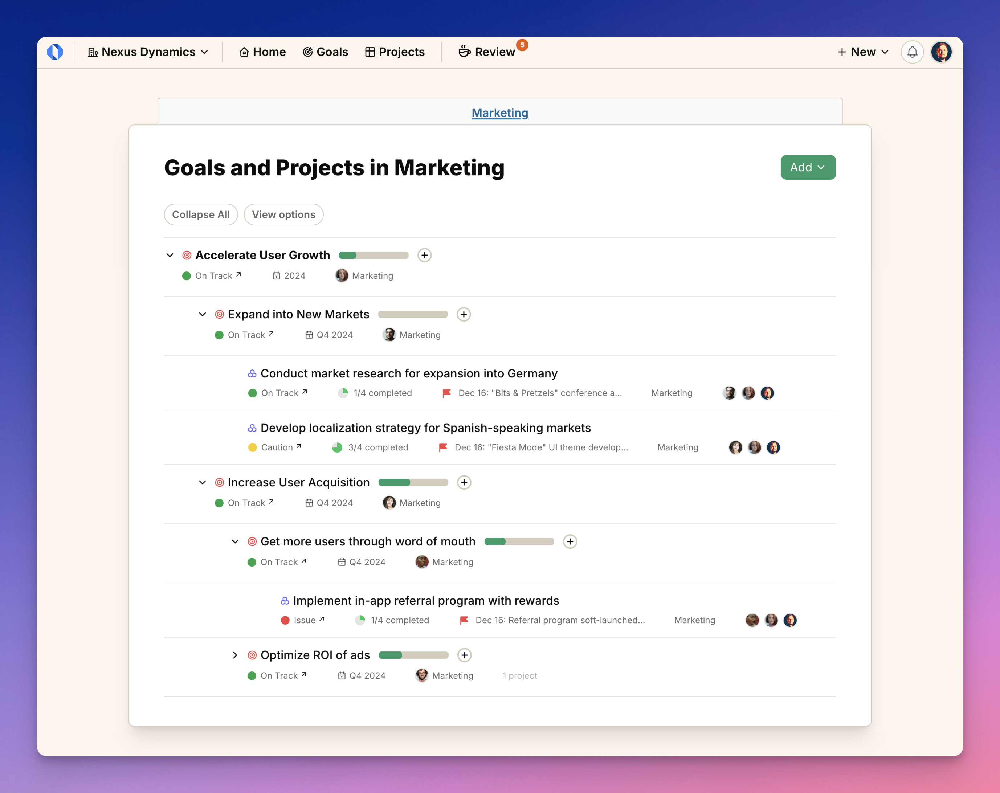
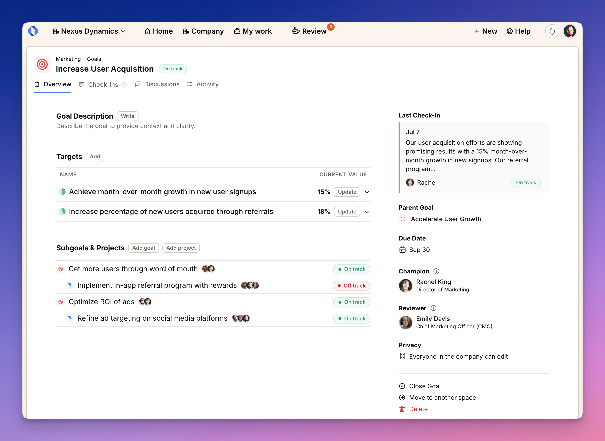
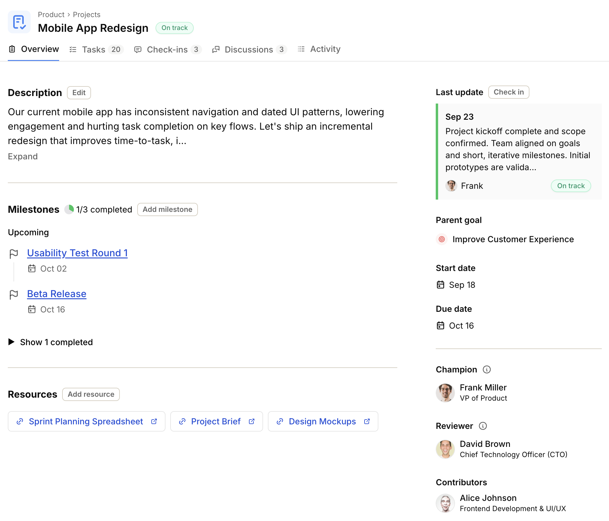
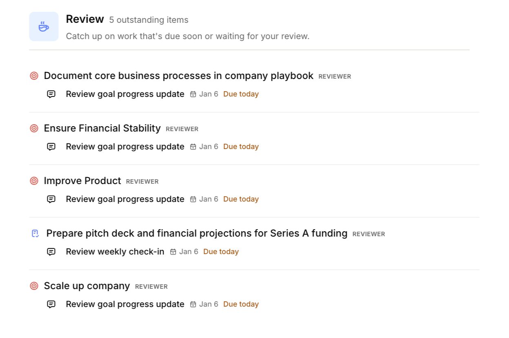

import ImageEnhancer from '@/components/ImageEnhancer.astro';

<ImageEnhancer />

Welcome to Operately! We're happy to have you.
To get started, [sign up for a cloud account](https://operately.com) or [set up a self-hosted instance](/install) and check out the guide below for a quick tour.

## Home screen

The home screen is a portal to your company's activities and workspaces:

- **Spaces**: See all spaces you have access to. The Company space is built-in and serves as a shared space for everyone. Create additional spaces for different teams and departments.

- **Activity Feed**: See all recent activity across spaces - updates, changes, discussions, and more. Click any item to see details or join the conversation.

## Inside a space

Each space organizes work for a group or department that shares common goals and projects. Here's what you'll find on the page of each space:

- **Goals & Projects overview**: See progress and status of ongoing work
- **Discussion board**: The latest news, updates, and discussions
- **Activity feed**: A timeline for the latest activities within this space

### Ongoing goals and projects

Goals can be nested to show how work connects:

- Progress bars show current status
- Timelines show when work is planned
- Team ownership and member involvement
- Projects attach to goals they support

### Inside a Goal

Each goal page has four key sections:

#### Current Status

Success conditions show measurable targets and progress:

- **Progress bars**: Green sections show completion toward target
- **Current value**: Shows where you are now (e.g., "3%" churn rate)
- **Target**: Shows where you want to be (e.g., "Target: 5 → 2")

Updates appear below conditions, showing the latest status and team commentary.

#### Sub-Goals and Projects

- Related goals that support this goal
- Projects linked to achieve the objectives
- Progress indicators and timelines

#### Discussions

- Progress updates
- Team conversations
- Status discussions

#### About

- Goal champion and reviewer
- Description and context
- Basic goal information

The top bar shows goal type, timeframe, and lets you update progress at any time.

## Project View

Each project includes:

### Overview

- Project status and completion metrics
- Team members and access controls
- Project description
- Parent goal link

### Timeline

- Start and due dates
- Upcoming milestones
- Completed milestones with dates
- Progress tracking

### Check-Ins

Weekly check-ins keep everyone in sync with project progress. Champions answer simple questions about project health, share recent developments, and flag any blockers. Team members can discuss updates and get notified of new check-ins.

### Resources

Connect project-related tools and documents:

- Slack channels
- GitHub repositories
- Google docs/sheets
- External links

#### Activity

Shows a chronological feed of project updates and changes.

## Review Queue

The Review screen shows actions that need your attention:

- Due check-ins for projects you champion
- Updates requiring your review
- Time-sensitive and overdue items are marked in red

Each item links directly to where action is needed, keeping you on top of your responsibilities without extra navigation.
