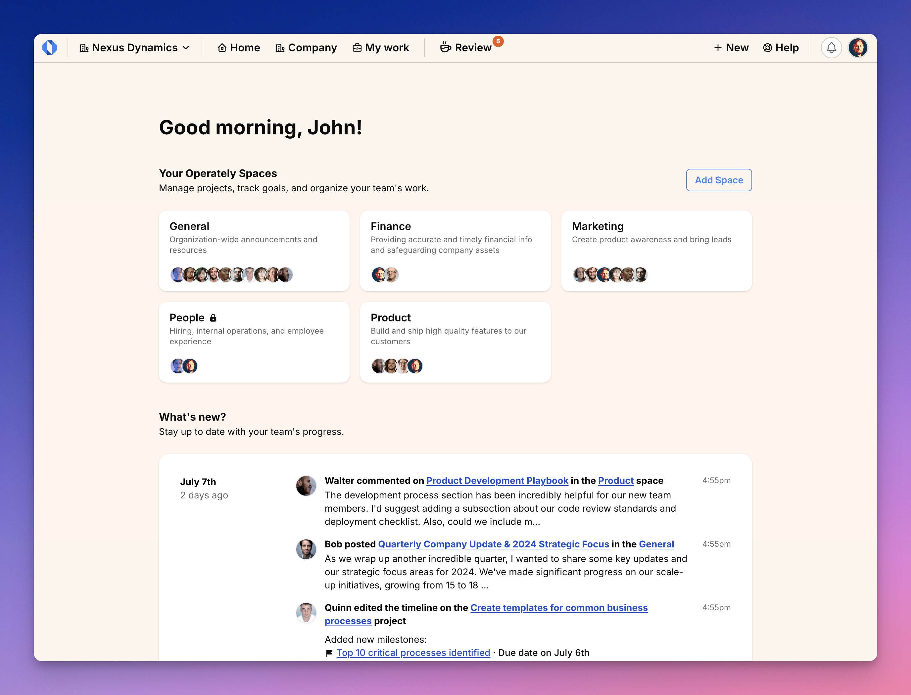
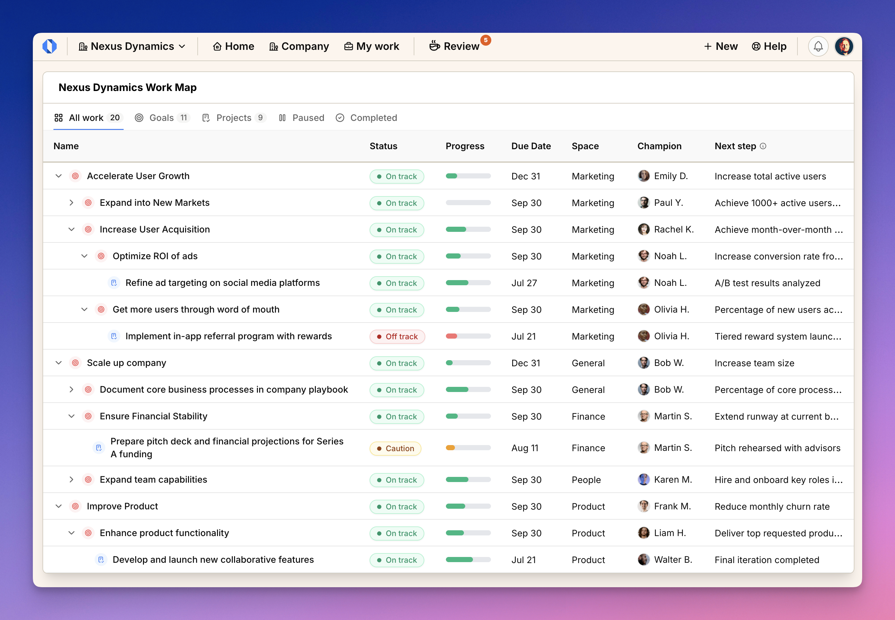

import ImageEnhancer from '@/components/ImageEnhancer.astro';

<ImageEnhancer />

This tour will walk you through Operately's main screens and features to help you get oriented quickly. We'll cover the key areas of the interface and explain what you can do in each section.

## Home screen

The home screen is a portal to your company's activities and workspaces:

- **Spaces**: See all spaces you have access to. The Company space is built-in and serves as a shared space for everyone. Create additional spaces for different teams and departments.

- **Activity Feed**: See all recent activity across spaces - updates, changes, discussions, and more. Click any item to see details or join the conversation.

## Inside a space

Each space organizes work for a group or department that shares common goals and projects. Here's what you'll find on the page of each space:

- **Goals & Projects overview**: See progress and status of ongoing work
- **Discussion board**: The latest news, updates, and discussions
- **Activity feed**: A timeline for the latest activities within this space

## Work maps: The big picture

See all your team's ongoing work at a glance. The Work Map view organizes everything in an intuitive hierarchy that shows how work connects — from high-level company goals down to the specific projects making them happen.

What you'll see:
- Strategic goals break down into smaller, focused initiatives
- Projects link directly to the goals they support
- Clear progress indicators and timelines for every piece of work
- Team members assigned to each goal and project

For example, a marketing goal to "Increase user acquisition" may be broken down into sub-goals that are executed with projects for running targeted ads and building word-of-mouth. Each project shows its progress, timeline, and the team members involved.

**Why it matters:** For managers, this view helps you make informed decisions about where to focus your team's efforts. For team members, you can easily see how your day-to-day work contributes to larger company objectives.

## Goal tracking

Goals in Operately track meaningful progress, not just completion percentages. Each goal has specific targets that measure real outcomes.

#### Measurable targets

Instead of guessing progress, goals track concrete metrics. A goal might have targets like "100 new customers in the next quarter" or "7 blocker areas addressed" - you know exactly what success looks like.

#### Team collaboration

Goals have champions (who owns it) and reviewers (who provides oversight). Regular check-ins keep everyone aligned on progress and blockers.

#### Connected work

See how subgoals and projects contribute to the main goal. Everything flows together - when a project completes, you can see its impact on the goal's targets.

#### Real-time updates

Team discussions, progress updates, and check-ins all feed into the goal page. Stay informed without hunting through different tools.

## Inside a project

Projects help you execute with clarity. Each project page is split into tabbed sections:

#### Overview

The project Overview tab gives you a fast read on where things stand—current status, upcoming milestones, and the links to resources that matter. It highlights context, ownership, and how the work ladders up to the goal so you can quickly spot what needs attention.

#### Tasks

The Tasks tab organizes work by milestone, with progress rings so you always see how each track is moving. Create or reorder milestones and tasks, adjust milestone deadlines and descriptions, update task status, assignees, or due dates, and open task details for notes and discussion without losing context.

#### Check-ins

Weekly check-ins keep teams aligned. Project owners answer quick questions about health, share recent progress, and raise any blockers. Team members stay notified and can discuss updates directly in the check-in thread.

#### Discussions

The Discussions tab is where all project-related conversations happen. Instead of scattered emails, everything stays organized in one place. You can start new threads, reply to comments, and keep context with the work.

#### Activity
The Activity tab provides a complete history of everything that has happened in the project. From status changes to task updates and comments, you can see who did what and when. This transparency helps with accountability and keeps everyone on the same page.

## Review queue

The Review screen helps you stay on top of your tasks - whether you own work or review it. See what needs your attention:

- Write check-ins for goals or projects you champion
- Review updates from your team members
- Track overdue items marked in red

Each item links directly to where action is needed, keeping you on top of your responsibilities without extra navigation.
