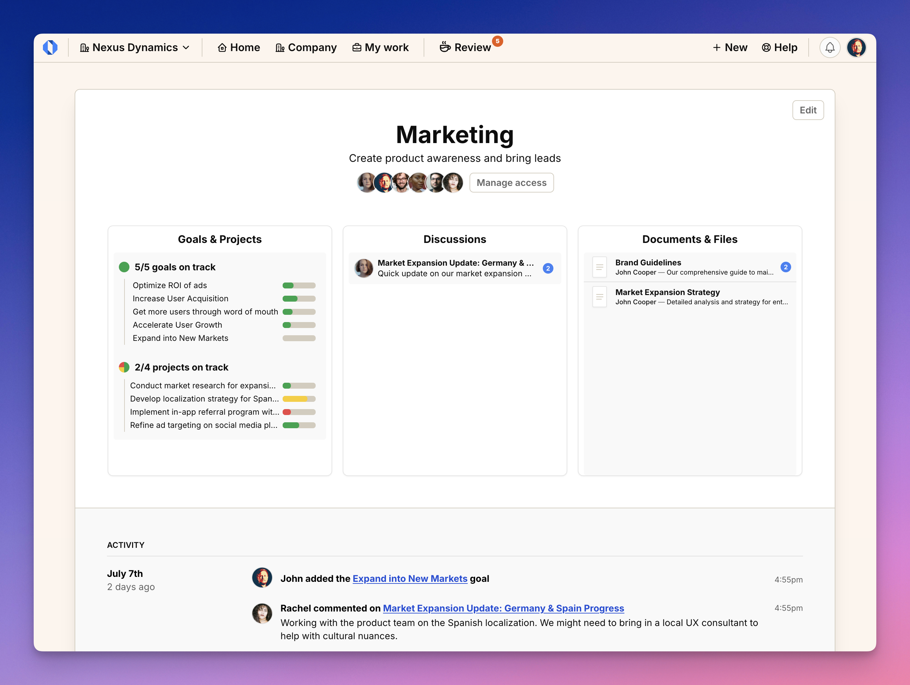
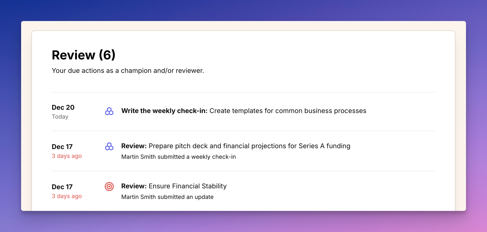

import ImageEnhancer from '@/components/ImageEnhancer.astro';

<ImageEnhancer />

Welcome to Operately! We're happy to have you.
To get started, [sign up for a cloud account](https://operately.com) or [set up a self-hosted instance](/install) and check out the guide below for a quick tour.

## Home screen

The home screen is a portal to your company's activities and workspaces:

- **Spaces**: See all spaces you have access to. The Company space is built-in and serves as a shared space for everyone. Create additional spaces for different teams and departments.

- **Activity Feed**: See all recent activity across spaces - updates, changes, discussions, and more. Click any item to see details or join the conversation.

## Inside a space

Each space organizes work for a group or department that shares common goals and projects. Here's what you'll find on the page of each space:

- **Goals & Projects overview**: See progress and status of ongoing work
- **Discussion board**: The latest news, updates, and discussions
- **Activity feed**: A timeline for the latest activities within this space

## Goals & Projects view: The big picture

See all your team's ongoing work at a glance. The Goals & Projects view organizes everything in an intuitive hierarchy that shows how work connects — from high-level company goals down to the specific projects making them happen.

What you'll see:
- Strategic goals break down into smaller, focused initiatives
- Projects link directly to the goals they support
- Clear progress indicators and timelines for every piece of work
- Team members assigned to each goal and project

For example, a marketing goal to "Expand into New Markets" might include projects for market research and localization strategy. Each project shows its progress, timeline, and the team members involved.

**Why it matters:** For managers, this view helps you make informed decisions about where to focus your team's efforts. For team members, you can easily see how your day-to-day work contributes to larger company objectives.

## Goal details

Goals in Operately combine measurable targets with team collaboration. Here's what you'll find on every goal page:

#### Current Status

Track progress through success conditions - specific metrics you need to hit. Each condition shows:

- Current value vs target (e.g., "18% referrals, Target: 10 → 30")
- Visual progress bar
- Latest status update with team context

Use the "Update Progress" button in the top bar to log new metrics anytime.

#### Sub-goals and projects

See the full execution plan - both smaller goals and specific projects that drive progress. Each item displays its timeline and current status.

#### Discussions
Follow status updates and team conversations in one feed. Comment, ask questions, or flag issues to keep everyone aligned.

#### About
Find key context like the goal owner, reviewer, timeline, and description.

## Inside a project

Projects help you execute with clarity. Each project page shows:

#### Overview

Current status, milestones completed, and team composition. See how the project connects to larger goals and who's involved in making it happen.

#### Timeline & Tasks

Track milestones with due dates while managing detailed tasks in kanban boards. Organize work visually and move cards as you progress.

#### Check-ins

Weekly check-ins keep teams aligned. Project owners answer quick questions about health, share recent progress, and raise any blockers. Team members stay notified and can discuss updates directly in the check-in thread.

#### Resources

Link to your essential tools and docs - whether that's Slack channels, GitHub repos, or Google Drive files. Everything you need, all in one place.

#### Activity Feed
Follow all project developments chronologically, from status changes to team discussions.

Want the full picture? Check the project's goal connection to see how your work drives bigger objectives.

## Review queue

The Review screen helps you stay on top of your tasks - whether you own work or review it. See what needs your attention:

- Write check-ins for goals or projects you champion
- Review updates from your team members
- Track overdue items marked in red

Each item links directly to where action is needed, keeping you on top of your responsibilities without extra navigation.