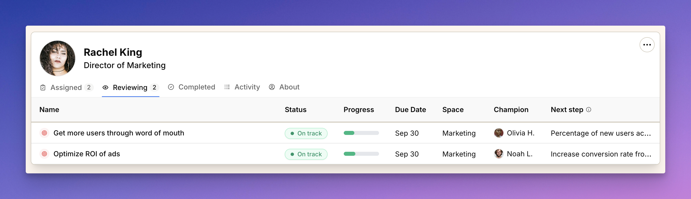

import { Aside } from '@astrojs/starlight/components';
import ImageEnhancer from '@/components/ImageEnhancer.astro';

<ImageEnhancer />

The Reviewing tab shows all the work you're responsible for reviewing or providing oversight on. This is where you can stay aware of what your team is working on and provide guidance when needed.

## What you'll see in the Reviewing tab

The Reviewing tab displays work that others are doing where you have oversight responsibilities:

- **Name** — The title of the goal or project being reviewed
- **Status** — Current state (On Track, At Risk, Off Track, etc.)
- **Progress** — Visual bar showing completion percentage
- **Due Date** — When the work should be finished
- **Space** — Which team or department owns the work
- **Champion** — The person doing the work (who you're reviewing)
- **Next Step** — The immediate action they need to take

## Understanding your review responsibilities

You'll see work in this tab when:

- **You're a manager** reviewing work from your direct reports
- **You're designated as a reviewer** on specific goals or projects
- **You have oversight responsibilities** for certain types of work
- **You're a co-champion** on work where someone else is the primary champion

## Managing your review responsibilities

This tab helps you provide effective oversight without micromanaging:

- **Click on any goal or project name** to open its detailed page where you can see full context, discussions, and progress updates
- **Click on the champion's name** to view their profile and understand their workload
- **Use the status indicators** to quickly identify work that needs your attention or guidance
- **Monitor progress** to ensure work is advancing as expected

## When to use the Reviewing tab

**Regular check-ins** — Review this tab weekly to stay aware of your team's progress and identify any issues early.

**Performance management** — Use this view to understand your direct reports' workload and provide appropriate support.

**Quality assurance** — Monitor work that you have oversight responsibility for to ensure it meets standards.

**Resource allocation** — Identify if team members are overloaded or if work is distributed appropriately.

<Aside>The Reviewing tab is different from the [Review page](/help/review-due-actions) in the top navigation. The Review page shows specific actions you need to take (like check-ins), while the Reviewing tab shows all work you have oversight responsibility for.</Aside>

## Tips for effective oversight

- **Don't micromanage** — Use this view to stay informed, not to control every detail
- **Provide timely feedback** — When you see work that needs attention, reach out proactively
- **Support your team** — Use this information to help team members succeed, not just monitor them
- **Balance oversight with autonomy** — Let people do their work while staying available for guidance

The Reviewing tab helps you be a supportive manager or reviewer without getting lost in the details of work you're not directly doing. 