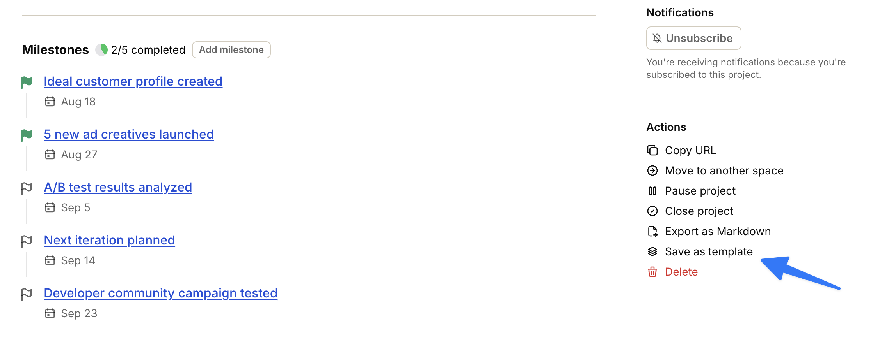

import { Aside, Steps } from '@astrojs/starlight/components';
import ImageEnhancer from '@/components/ImageEnhancer.astro';

<ImageEnhancer />

Save a live project as a template when you want to reuse its structure for later work. You need Edit Access on the project's space.

## How to get there

- Project **Overview** → **Actions** → **Save as template**

## Save as template

<Steps>
1. Open the project and go to the **Overview** tab.
2. In the sidebar **Actions**, click **Save as template**.
3. On **Save project as template**, review **Template name** and **Description**.
4. Under **Include**, choose which parts to copy:
   - **People and assignments** — *Copies the project team with their roles and access.* Off by default.
   - **Discussions** — On by default.
   - **Comments** — Off by default.
   - **Docs & Files** — On by default.
5. Click **Save as template**. Click **Cancel** to close without saving.
</Steps>

Operately then opens the new template so you can keep editing it. See [Project templates](/help/project-templates).

## Edge cases

<Aside type="caution">
If some dates are before the project start date, Operately blocks the save until you change or remove those dates. Comments copy only when you also include **Discussions** and/or **Docs & Files**. Health, check-ins, retrospectives, activity, and subscriptions are never copied.
</Aside>

If people in the template are no longer active, creating a project from it leaves those roles and assignments unassigned.
