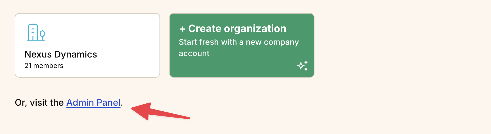
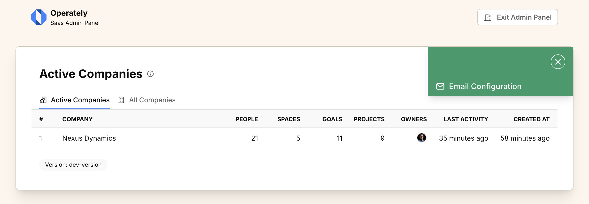
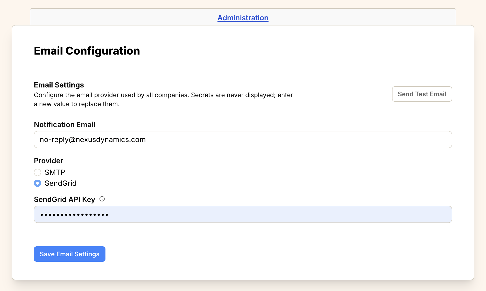
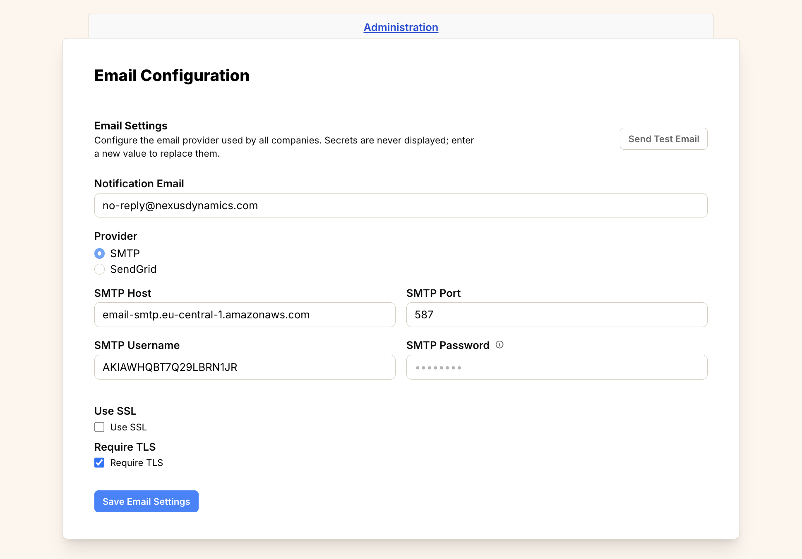

import { Aside } from '@astrojs/starlight/components';
import ImageEnhancer from '@/components/ImageEnhancer.astro';

<ImageEnhancer />

Operately requires email functionality to send notifications, invitations, and
password reset emails. This guide explains how to configure email delivery for
your self-hosted installation.

## Email delivery options

Operately supports two methods for email delivery:

1. **SendGrid API** (recommended for simplicity)
2. **SMTP** (compatible with most email providers)

## Accessing Email Configuration

Configuration is done through the Admin Panel:

1. Log in with a **site administrator** account.
2. From the lobby page (before selecting a company), click the **Admin Panel** link.



3. In the top-right corner, click the **...** options button.
4. Select **Email Configuration** from the dropdown menu.



## SendGrid API configuration

SendGrid is a reliable email delivery service that's easy to set up and scale.

### Prerequisites

1. Create a [SendGrid account](https://sendgrid.com/)
2. Verify your sender identity (domain or single sender)
3. Generate an API key with mail sending permissions

### Configuration steps

1. **Create an API key:**
   - Log in to your SendGrid dashboard
   - Go to **Settings** > **API Keys**
   - Click **Create API Key**
   - Choose **Restricted Access**
   - Grant **Mail Send** permissions
   - Copy the generated API key

2. **Configure in Operately:**
   - In the Email Configuration form, enter your **Notification Email** (e.g., `no-reply@nexusdynamics.com`).
   - Select **SendGrid** as the Provider.
   - Paste your API key into the **SendGrid API Key** field.
   - Click **Save Email Settings**.



## SMTP configuration

SMTP is a standard protocol supported by most email providers including Gmail,
Outlook, AWS SES, Mailgun, and others.

### Common SMTP providers

| Provider | SMTP Server                     | Port    | Security     |
| -------- | ------------------------------- | ------- | ------------ |
| Gmail    | smtp.gmail.com                  | 587     | STARTTLS     |
| Outlook  | smtp-mail.outlook.com           | 587     | STARTTLS     |
| AWS SES  | email-smtp.region.amazonaws.com | 587     | STARTTLS     |
| Mailgun  | smtp.mailgun.org                | 587     | STARTTLS     |
| Custom   | your-mail-server.com            | 587/465 | STARTTLS/SSL |

### Configuration steps

1. **Gather SMTP credentials:**
   - SMTP server hostname
   - Port number (usually 587 for STARTTLS or 465 for SSL)
   - Username and password
   - Security method (STARTTLS or SSL)

2. **Configure in Operately:**
   - In the Email Configuration form, enter your **Notification Email**.
   - Select **SMTP** as the Provider.
   - Enter the **SMTP Host**, **SMTP Port**, **SMTP Username**, and **SMTP Password**.
   - Check **Use SSL** if your provider uses SSL (typically port 465).
   - Check **Require TLS** if your provider uses STARTTLS (typically port 587).
   - Click **Save Email Settings**.



### Provider-specific settings

#### Gmail

1. Enable 2-factor authentication on your Google account
2. Generate an [App Password](https://support.google.com/accounts/answer/185833)
3. Use the app password as your SMTP password

- **Host**: `smtp.gmail.com`
- **Port**: `587`
- **Username**: `your-email@gmail.com`
- **Password**: `your_app_password`
- **Require TLS**: Checked

#### AWS SES

1. Verify your domain or email address in AWS SES
2. Create SMTP credentials in the AWS SES console
3. Choose the appropriate region endpoint

- **Host**: `email-smtp.us-east-1.amazonaws.com` (varies by region)
- **Port**: `587`
- **Username**: `your_ses_username`
- **Password**: `your_ses_password`
- **Require TLS**: Checked

#### Mailgun

1. Add and verify your domain in Mailgun
2. Get your SMTP credentials from the domain settings

- **Host**: `smtp.mailgun.org`
- **Port**: `587`
- **Username**: `postmaster@your-domain.com`
- **Password**: `your_mailgun_password`
- **Require TLS**: Checked

## Testing email configuration

After configuring email delivery, test that it's working correctly:

1. **Send a test email:**
   - On the Email Configuration page, click the **Send Test Email** button.
   - In the form that opens, enter a **Recipient** email address.
   - Enter a **Subject** and **Body**.
   - Click **Send Test Email**.
   - You will see a success or error message indicating if the configuration works.

2. **Test password reset:**
   - Log out of your account.
   - Click "Forgot password?" on the login screen.
   - Enter your email address and click "Reset Password".
   - Check your inbox for the password reset email.

3. **Check server logs:**
   If you encounter issues, check the logs for detailed error messages:
   ```bash
   docker compose logs | grep email
   ```

## Troubleshooting

### Common issues

**Authentication failed:**
- Double-check your username and password
- Ensure 2FA and app passwords are configured correctly
- Verify your SMTP provider allows the connection

**Connection timeout:**
- Check firewall rules allow outbound connections on the SMTP port
- Verify the SMTP hostname is correct
- Try increasing the timeout value (if configurable)

**Email not delivered:**
- Check spam/junk folders
- Verify sender reputation with your email provider
- Review email provider logs for bounce/rejection reasons

**SSL/TLS errors:**
- Ensure the security method matches your provider's requirements
- Try different ports (587 for STARTTLS, 465 for SSL)
- Check if your provider requires specific TLS versions

## Security considerations

- **Use app passwords**: Never use your main account password for SMTP
- **Enable encryption**: Always use STARTTLS or SSL when available
- **Limit permissions**: Use email service accounts with minimal required permissions
- **Monitor usage**: Regularly review email sending patterns and limits
- **Rotate credentials**: Periodically update API keys and passwords
