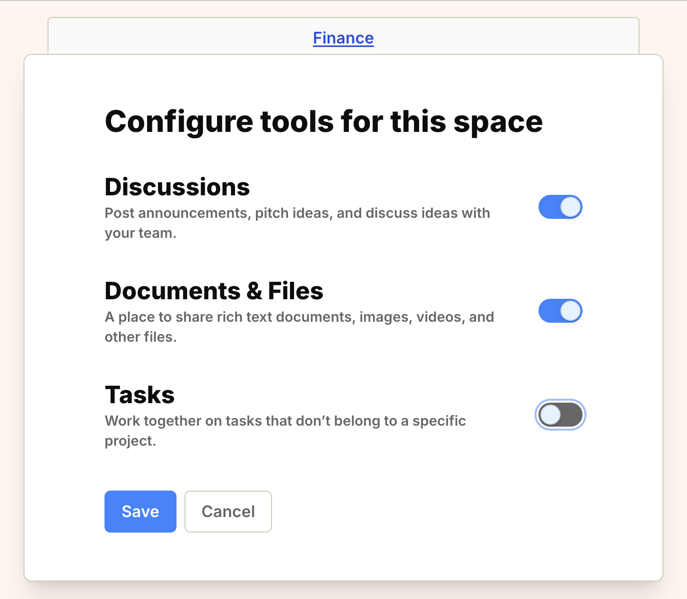

import { Aside } from '@astrojs/starlight/components';
import ImageEnhancer from '@/components/ImageEnhancer.astro';

<ImageEnhancer />

Space admins can enable or disable the following tools for each space: Resource Hub, Discussions, and Tasks. This helps keep each space focused on the workflows that matter and hides sections your team does not use.

## How to configure Space Tools

1. Navigate to the space you want to configure.
2. Click on the **"..."** icon in the top right corner.
3. Select **Configure tools** from the dropdown menu.
4. Toggle the switches to enable or disable specific tools for that space.

<Aside>Disabling a tool hides it from the sidebar and navigation, but it does not delete any data associated with that tool. You can re-enable it at any time to restore access.</Aside>

## Available Tools

- **Resource Hub**: For managing documents, files, and links.
- **Discussions**: For team conversations and announcements.
- **Tasks**: For tracking space level tasks which aren't associated with any specific project.

By customizing the tools available in each space, you can create a cleaner, more relevant environment for your team.
