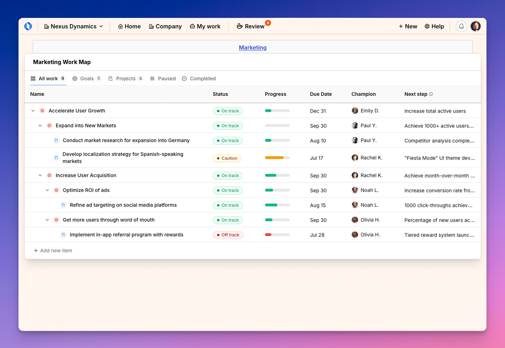

import { Steps } from '@astrojs/starlight/components';
import { Aside } from '@astrojs/starlight/components';
import ImageEnhancer from '@/components/ImageEnhancer.astro';

<ImageEnhancer />

The Space Work Map provides a focused view of all goals and projects within a specific space or team. It helps team members and managers track progress, manage priorities, and maintain visibility into space-specific initiatives.

## Accessing the Space Work Map

There are multiple ways to access a Space Work Map:

### From the Space page

Navigate to the desired space, then click on **Goals & Projects** in the space tools section.

### From the Company Work Map

<Steps>
1. Open the Company Work Map from the main navigation.
2. Find a work item associated with the space you want to view.
3. Click on the space name in the "Space" column to navigate directly to that space's Work Map.
</Steps>

## Understanding the Space Work Map layout

The Space Work Map has a similar layout to the Company Work Map, with a few key differences:

### 1. Header section

At the top of the Work Map, you'll see:
- The title showing the space name followed by "Work Map"
- Navigation breadcrumbs to return to the space
- Navigation tabs for filtering content (All, Goals, Projects, etc.)

### 2. Work items table

The main table shows all work items within the space with columns for:

- **Name:** The title of the goal or project
- **Status:** Current status (On Track, At Risk, Off Track, etc.)
- **Progress:** Visual indicator of completion percentage
- **Due Date:** When the work is scheduled to be completed
- **Owner:** The person responsible for the work
- **Next Step:** The upcoming action needed

<Aside>Unlike the Company Work Map, the Space Work Map does not include a "Space" column since all items belong to the current space.</Aside>

Note: When viewing the "Completed" tab, the columns change to show: Name, Status, Completed On, and Champion.

## Filtering the Space Work Map

Use the tabs at the top of the Work Map to filter the view:

- **All:** Shows all goals and projects in the space
- **Goals:** Shows only goals in the space
- **Projects:** Shows only projects in the space
- **Paused:** Shows work that is currently on hold
- **Completed:** Shows work that has been finished

## Benefits of using the Space Work Map

- **Team focus:** Concentrate on the work relevant to your team
- **Streamlined view:** See only what matters to your specific space
- **Progress tracking:** Monitor how your team is advancing on its commitments
- **Priority management:** Ensure the team is focusing on the most important work first

## Navigating between Space and Company Work Maps

You can easily move between viewing a specific Space Work Map and the overall Company Work Map:

1. To go from Space to Company: Use the main navigation menu and select the Company Work Map
2. To go from Company to Space: Click on any space name in the Company Work Map
