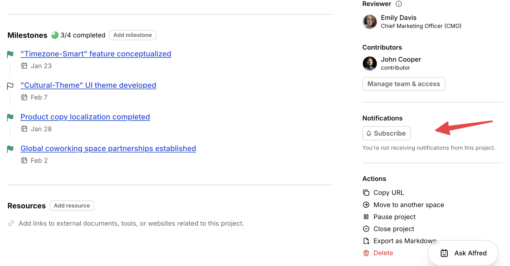

import { Aside } from '@astrojs/starlight/components';
import ImageEnhancer from '@/components/ImageEnhancer.astro';

<ImageEnhancer />

You can subscribe to any project, milestone, or task to receive notifications whenever updates occur. This allows you to stay informed about progress and changes without needing to constantly check the resource.

## How to subscribe

To subscribe to a resource:

1. Navigate to the Project, Milestone, or Task page you want to follow.
2. Look for the **Subscribe** button in the sidebar.
3. Click the button to start receiving notifications.

You can unsubscribe at any time by clicking the same button, which will now say **Unsubscribe**.

## Automatic subscriptions

In some cases, you are automatically subscribed to a resource to ensure you don't miss important updates relevant to you.

You are automatically subscribed when:

- **Projects**: You become a contributor to the project.
- **Milestones**: You are mentioned in the milestone's comments.
- **Tasks**: You are assigned the task or mentioned in its comments.

<Aside>Even if you were automatically subscribed, you can always choose to unsubscribe at any moment if you no longer wish to receive notifications for that specific resource.</Aside>
