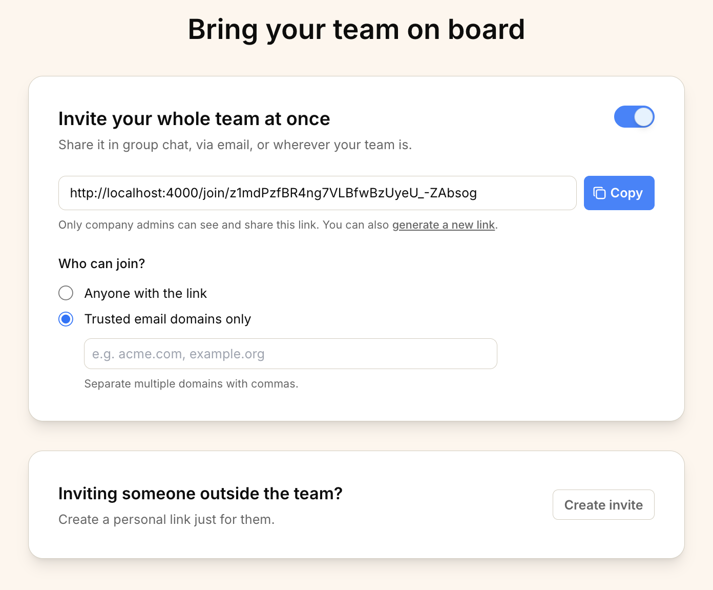

import ImageEnhancer from '@/components/ImageEnhancer.astro';
import { Steps, Aside } from '@astrojs/starlight/components';

<ImageEnhancer />

Inviting team members one by one can be tedious. With **Team Invite Links**, you can generate a single, shareable link that lets your entire team join your organization instantly.

## Accessing the Team Invite page

To access the team invite settings:

1. Navigate to the **Home** page.
2. Click the **Invite People** button in the top right corner.

## Managing your Team Invite Link

On the invite page, you have full control over how your team joins.

### Enable or disable the link

You can toggle the invite link on or off at any time.

*   **Enabled**: Anyone with access to the link (and meeting the security requirements) can join your organization.
*   **Disabled**: The link will not work, and no one can use it to join.

### Control who can join

You can restrict who is allowed to use the invite link:

*   **Anyone with the link**: Any user who has the link can join your organization.
*   **Trusted email domains only**: Only users with an email address from your trusted domains (e.g., `@yourcompany.com`) can join. This adds an extra layer of security.

<Aside type="tip">
We recommend setting up [Trusted Email Domains](/help/add-trusted-email-domain) and selecting "Trusted email domains only" for the most secure onboarding experience.
</Aside>

### Share the link

Once your link is configured:

1. Click the **Copy** button next to the link URL.
2. Share the link with your team.

### Generate a new link

If you need to revoke access to the current link (for example, if it was shared with the wrong person), you can generate a new one.

1. Click the **generate a new link** text below the link box.
2. This will immediately invalidate the old link and create a new one. Anyone trying to use the old link will no longer be able to join.

## Inviting specific people

If you prefer to invite someone individually:

1. In the **Inviting someone outside the team?** section, click the **Create invite** button.
2. You will be redirected to a page where you can create an invitation for a specific person.
