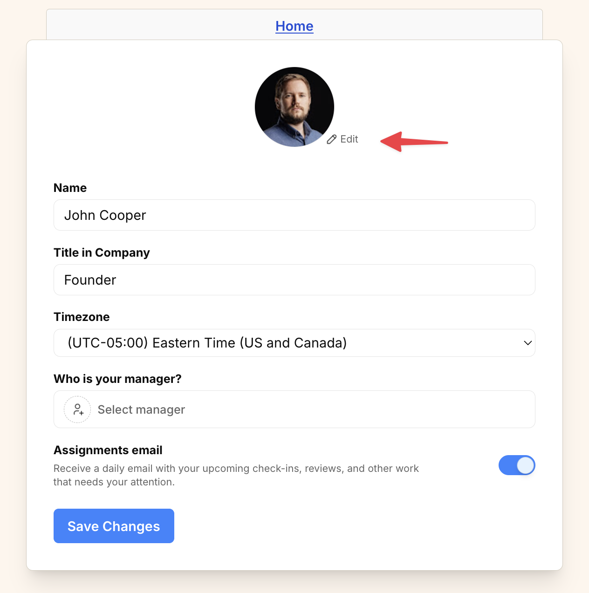

import { Steps } from '@astrojs/starlight/components';
import ImageEnhancer from '@/components/ImageEnhancer.astro';

<ImageEnhancer />

Your profile picture helps your team recognize you in Operately. You can easily update it from your profile settings.

## How to update your profile picture

<Steps>
1. Click on your avatar or initials in the top-right corner of the screen.
2. Select **Profile** from the dropdown menu.
3. Click the **Edit** link to the right of your current profile picture (or initials).

4. Select a new picture from your machine.
5. Click **Save Changes** to apply your new profile picture.
</Steps>
