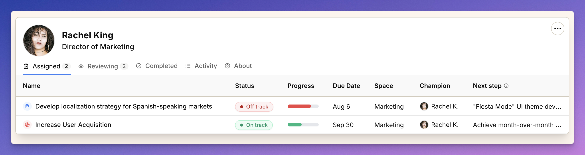

import { Aside } from '@astrojs/starlight/components';
import ImageEnhancer from '@/components/ImageEnhancer.astro';

<ImageEnhancer />

Your profile page is your personal command center in Operately. It's where you can see everything you're responsible for, track your contributions, and understand your place in the organization.

## What makes profiles special

Unlike traditional project management tools that scatter your work across different views, your profile brings everything together. You can see what you own, what you're reviewing, what you've accomplished, and how you fit into the bigger picture — all in one place.

## Five tabs, five perspectives

Your profile is organized into five tabs, each giving you a different view of your work and relationships:

**Assigned** — Your active work. Shows all goals and projects where you're the champion or a contributor. This is your daily dashboard for what needs your attention right now.

**Reviewing** — Your oversight responsibilities. Shows work from your direct reports or projects where you're designated as a reviewer. Keeps you aware of what's happening on your team.

**Completed** — Your track record. Shows all the goals and projects you've finished. Great for performance reviews, portfolio building, or just feeling good about your accomplishments.

**Activity** — Your audit trail. Shows a chronological record of everything you've done in Operately — updates, comments, documents created, and more. Useful for remembering what you worked on or providing status updates.

**About** — Your place in the organization. Shows your contact information and organizational relationships. See who you report to, who reports to you, and who your peers are.

## Accessing your profile

Click on your profile picture in the top navigation bar to open your profile page. You'll see your name, title, and the five tabs that organize your information.

## Navigating between profiles

You can also view other people's profiles by clicking on their name anywhere in Operately. This is particularly useful for:
- Understanding who's responsible for what
- Finding the right person to contact
- Learning about your colleagues' work and relationships

<Aside>When you view someone else's profile, you'll see the same tabs but with their information. This creates consistency across the platform and helps everyone understand how work is distributed.</Aside>

## When to use each tab

**Assigned** — Use this for:
- Daily task management
- Weekly planning
- Preparing for 1:1s with your manager
- Staying on top of your commitments

**Reviewing** — Use this for:
- Managing your team's work
- Providing feedback and guidance
- Ensuring quality and accountability
- Supporting your direct reports

**Completed** — Use this for:
- Performance reviews
- Portfolio building
- Reflecting on past work
- Planning future initiatives

**Activity** — Use this for:
- Remembering what you worked on
- Providing status updates
- Tracking your contributions
- Understanding your work patterns

**About** — Use this for:
- Understanding organizational structure
- Finding the right person to contact
- Onboarding new team members
- Building relationships across the company

Your profile turns scattered work into a coherent story of your contributions and relationships. Instead of wondering "what am I working on?" or "who should I talk to about this?" you can see exactly how you fit into the bigger picture. 