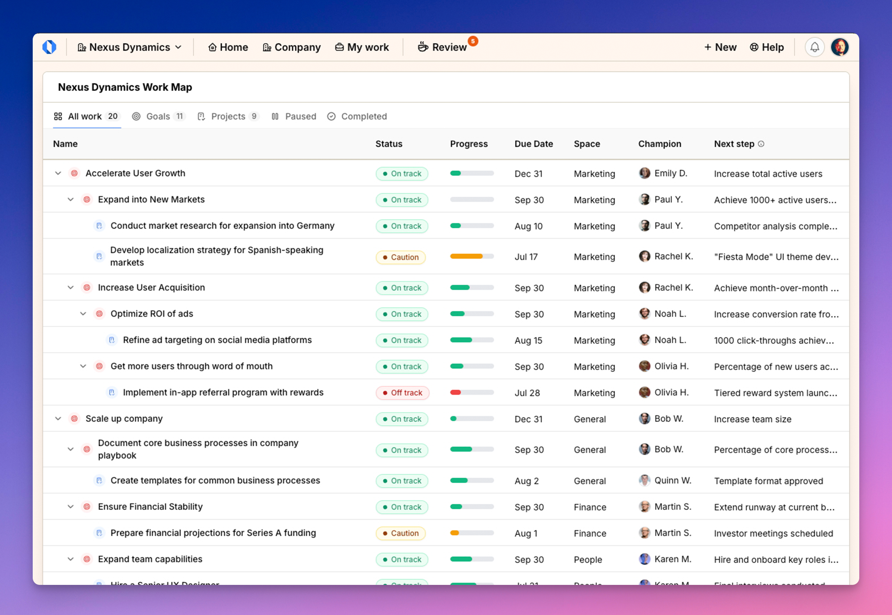
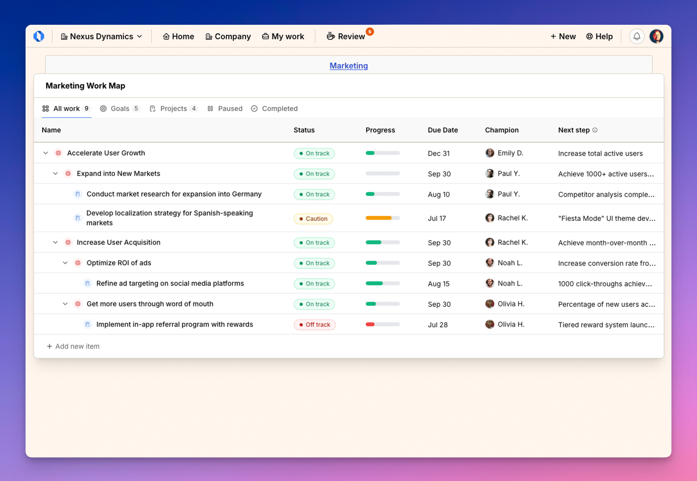

import { Aside } from '@astrojs/starlight/components';
import ImageEnhancer from '@/components/ImageEnhancer.astro';

<ImageEnhancer />

Work Maps provide a consolidated view of all ongoing work in your company or within specific spaces. They help you track goals and projects, visualize progress, and understand how work is distributed across your organization.

## What are Work Maps?

Work Maps are powerful visualization tools that display all ongoing goals and projects in a structured, tabular format. They give you:

- A bird's-eye view of all work happening across the company or within a specific space
- Quick insights into work status, progress, ownership, and timelines
- The ability to navigate between different spaces and their related work

## Types of Work Maps

Operately provides two main types of Work Maps:

### 1. Company Work Map

The Company Work Map shows all goals and projects across your entire organization. It provides leadership and team members with complete visibility into:

- All active and completed work
- How work is distributed across different spaces
- Overall company progress and status

### 2. Space Work Map

The Space Work Map focuses on goals and projects within a specific space or team. It helps space members:

- Track all work specific to their team
- Monitor progress on space-focused initiatives
- Stay aligned on current priorities and ownership

## Key features of Work Maps

Work Maps include several key features to help you navigate and understand your organization's work:

- **Filtering tabs:** Switch between viewing all work, goals only, projects only, paused work, or completed work
- **Progress indicators:** Visual indicators showing how far along each goal or project is
- **Status badges:** Clear labels showing if work is on track, at risk, needs attention, etc.
- **Owner information:** See who's responsible for each piece of work
- **Space navigation:** Easily move between different spaces through direct links
- **Next steps:** View upcoming actions for each goal or project

<Aside>Work Maps automatically update as work progresses, giving you real-time visibility into your organization's efforts.</Aside>
