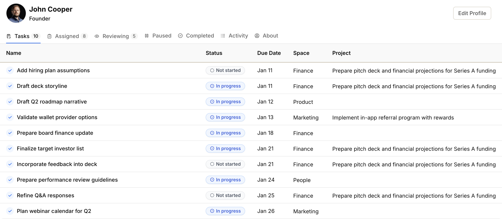

import { Aside } from '@astrojs/starlight/components';
import ImageEnhancer from '@/components/ImageEnhancer.astro';

<ImageEnhancer />

The Tasks tab shows all the tasks that are assigned to you. This helps you keep track of your individual action items across different projects and spaces.

## What you'll see in the Tasks tab

The Tasks tab displays your assigned tasks in a table format, showing:

- **Name** — The title of the task
- **Status** — Current state of the task (e.g., Todo, In Progress)
- **Due Date** — When the task should be finished
- **Space** — Which team or department owns the task
- **Project** — The project the task belongs to (if applicable; space tasks don't have a project)

## Managing your tasks

This tab helps you organize your daily work. You can:

- **Click on any task name** to open its page where you can update the status, add comments, or change details
- **Click on the project name** to see the context of the task within its project
- **Click on the space name** to navigate to the team or department workspace

<Aside>The Tasks tab aggregates tasks from all your projects and spaces, giving you a single place to see what you need to do.</Aside>
