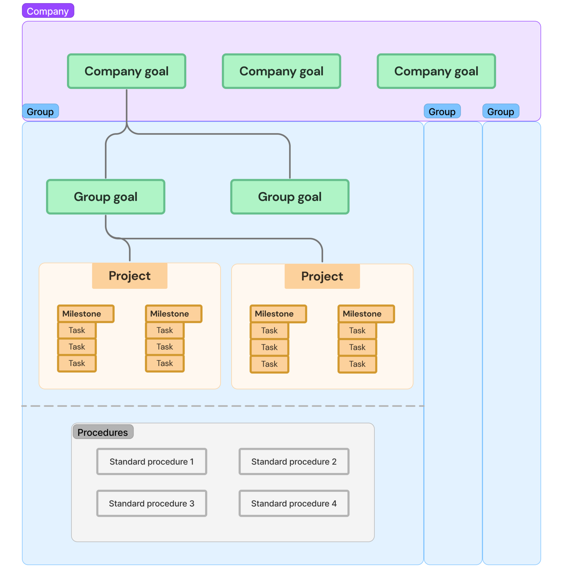
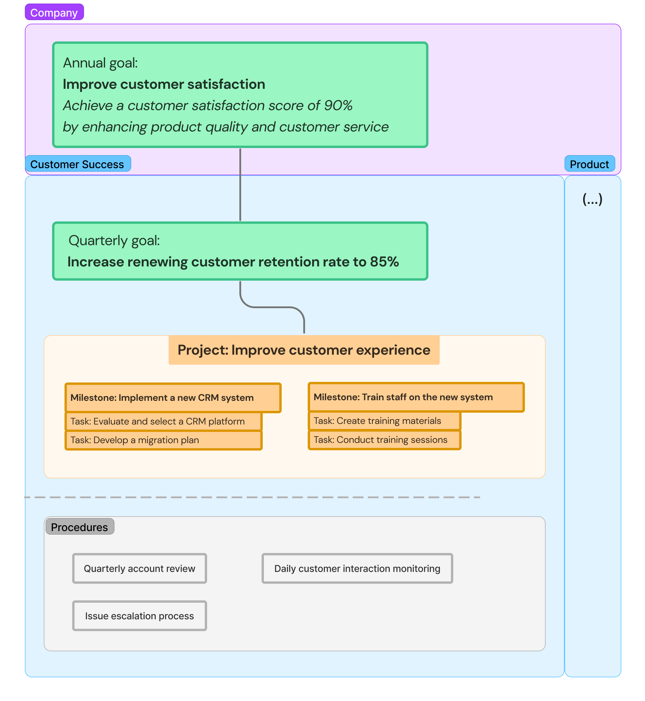

# The Blueprint

A company operations framework

Welcome to Operately’s framework for company operations.

You can read this guide in 10 minutes or less. Upon completion, you will be ready to start using Operately effectively or to craft your own company playbook using tools of your choice.

## The Cascade

The Cascade is a high-level model for structuring work at a startup that has reached product-market fit.
 
The primary aim of the Cascade is that every level of the organization is aligned with and working towards common goals.

### How it works

### Implementation

- **Company-wide goals**: Leadership establishes overarching goals for the company, usually for a year.
- **Group goals**: To support the company’s goals, groups formulate their own goals for a shorter term, such as quarterly.
- **Projects**: Teams initiate projects to achieve these goals. They track progress through the achievement of milestones. Milestones are accomplished by completing related tasks.
- **Procedures**: Team members execute recurring responsibilities by following standardized procedures documented in the company playbook, ensuring consistency and efficiency in ongoing operations.

There is always some unstructured work that doesn’t fit neatly in this model. This is perfectly fine when it’s one-off or part of an exploration.

### Example

Here’s an example of how a company goal maps to a department’s day-to-day work:

## The Cadence

The Cadence is the shared clock frequency for planning, reviewing, and sharing what everyone in the organization has been working on. It includes the following mandatory events:

### Events, their purpose, and key outputs

#### Annual review

- **Purpose**: Reflect on the past year's achievements, failures, and learnings to inform future strategies.
- **Outputs**: Briefings tailored for the leadership team, the board, and all employees.

#### Annual planning

- **Purpose**: Set company-wide objectives for the upcoming year, usually offsite.
- **Outputs**: Annual company goals.

#### Quarterly review

- **Purpose**: Assess completion of quarterly goals, progress towards annual goals, and adjust as needed.
- **Outputs**: Retrospectives on quarterly goals; briefings on key wins, challenges, and learnings from each department.

#### Quarterly planning

- **Purpose**: Facilitate company-wide thinking; work towards setting the upcoming quarter's goals, ensuring alignment with annual goals.
- **Outputs**: Quarterly goals for each department, group, and optionally individuals.

#### Quarterly all-hands meeting

- **Purpose**: Share company-wide updates, celebrate wins, have a Q&A, and foster a unified culture.
- **Outputs**: All-hands meeting.

#### Monthly group reviews

- **Purpose**: Review goals, KPIs, and ongoing projects to stay on track or identify areas needing attention.
- **Outpus**: Status updates on each goal and actively worked on KPI.

#### Monthly leadership meetings

- **Purpose**: Share key information from groups, align on strategic initiatives and resource allocation.
- **Outputs**: Knowledge, ideas and culture sharing; resolution of big issues; course correction.

#### Weekly project check-ins

- **Purpose**: Ensure projects are progressing as planned and address any roadblocks.
- **Outputs**: Written updates by project champions and optional follow-up discussions.

#### Daily team huddle

- **Purpose**: Keep team members aligned and informed about daily priorities and immediate tasks.
- **Outputs**: Daily standups (<15mins) or on-demand meetings during the week.

Having a common communication rhythm supports the organization in making sure that it is investing its resources in the most effective way and has feedback loops in place to continuously adapt and improve.

## Goals

Goals express how you want your current environment—your product, service, team, internal process, or the world—to change.

A goal needs to answer two questions:

1. Where do I want to go?   _(aka. the objective)_
2. How will I measure my progress towards the destination?   _(aka. key results or success conditions)_

Once a goal’s completion can be measured, we can always tell how we are doing and make adjustments if needed.

### Examples

Goals are a product of a planning process. 

On a high level, a company has a short list of strategic goals that it collectively wants to accomplish.

For example, here's a hypothetical company goal:

- **Goal**: Expand into the enterprise market
- **As measured by**: Signed 10 enterprise contracts by end of Q3

Once the strategy is clear, each department outlines how it will contribute to the company’s goals.

For example, the Product department may set the goal to adapt a cloud-based product for self-hosting:

- **Goal**: Make our product easy to install
- **As measured by**:
    - The installation process is reduced from 15 steps to 5 steps
    - System requirements have been reduced from 60GB to 20GB of memory

The Marketing department would focus on goals such as:

- **Goal**: Attract 100 leads for the enterprise product
- **As measured by**: 100 qualified leads in the pipeline

The Customer Service department would focus on sourcing beta testers from the existing customer base:

- **Goal**: Find internal customers to beta test the self-hosted product
- **As measured by**: 5 customers signed up for beta testing

Each department goal can be broken down further into sub-goals of a scope that matches the responsibilities of teams and individuals. For example, within Marketing, the blog and video teams would have sub-goals related to achieving a certain number of impressions, while the website team would focus on ensuring that the new pages it creates have appropriate conversion and bounce rates.

A well-crafted hierarchy of goals allows each team member to understand their personal contribution towards the team’s, department’s, and ultimately, the company’s success.

### Do’s and don’ts

Goals are a crucial instrument for growing a company and yet notoriously easy to get wrong in multiple ways, so here are a few tips on how to approach them.

Goals that matter express outcomes, not activities. For example:

| Goals based on outcomes ✅   (clear value, challenging to accomplish): | Goals based on activities ❌   (questionable value, straightforward to accomplish) |
| :---------------- | :------: |
| Ship __ features and products to users        | Submit __ code pull requests   |
| Manage $___ revenue from customers           | Have __ calls / send __ emails per week   |
| Generate __ impressions    | Create __ pieces of content   |

In the examples above, although all activities on the right-hand side are necessary to accomplish the outcomes on the left-hand side, merely completing them may not yield meaningful results. The value delivered depends on how these activities are executed.

Goals centered on completed activities can serve to pace oneself on a daily basis or to define baseline competence.

As a side effect, goals focused on outcomes are not prescriptive. They allow the people responsible to think creatively and explore the most effective solutions.

Each goal focuses on one outcome. This leaves no ambiguity when tracking progress and accountability. If you find yourself using “and” to express a goal, or wishing to assign multiple owners, this is a sign that a goal should be broken down.

### Goals have champions

Each goal has its champion, the person who is:

- Ultimately responsible for achieving it, and
- Accountable for providing progress updates on a regular basis (eg. monthly if the goal is quarterly).

### Goals have reviewers

To ensure information shared by champions doesn’t fall through the cracks, goals need a reviewer.

Reviewers are responsible for acknowledging each progress update and have the authority to initiate corrective action if needed. This is typically the person to whom the champion reports to.

## Projects

A project is a batch of work that requires multiple days and a team to be delivered.

### Projects start with a plan

Starting projects with a thoughtful plan ensures the best use of resources and sets a clear direction for success.

Here’s a checklist for crafting a good one:

1. **Context**: as an introduction, with an optional quick reminder of previous related work;
2. **Problem / solution** statement, if applicable;
3. **Related goal**: what current company or group goal does the project aim to advance.
4. **Milestones**: as a list of specific deliverables on a timeline, based on an educated guesstimate;
5. **Outcomes**: what immediate achievements this project aims to reach, especially if there is any impact on customers.
6. **Technical details**: high level, if applicable;
7. **Required resources**: people, optionally budget, etc;
8. **Risks**: potential negative impact on the larger product or program, including mitigation plan;
9. **Metrics for succes**s: based on specific performance metrics, user feedback, or other KPIs.

Here’s an example of a well-written project description:

User feedback and analytics indicate that our in-app messaging feature is underutilized.

Feedback and competitor analysis show that enhancing this feature could significantly improve user engagement and satisfaction.

What’s the problem: The current in-app messaging interface is not user-friendly, it requires too many steps and lacks features that users expect, such as message reactions.

This project aligns with the quarterly product development goal to improve user engagement metrics by 15%.

Team: a product manager, a UX/UI designer, two mobile developers, and a QA tester.

There is some risk of feature bloat leading to longer development times. We plan to mitigate that by strictly adhering to the project deadline and being open to reducing scope while regularly checking in to assess progress.

Metrics for success: A 20% increase in the usage of the in-app messaging feature, a 10% improvement in user engagement metrics within the app, and positive feedback from user surveys post-launch.

Every team member is encouraged to pitch project ideas. Pitches can evolve in stages, becoming more detailed and structured as their feasibility is assessed, until they mature into a comprehensive project description.

## Roles and responsibilities are clearly defined

### Champion
The champion is the owner of the project and is accountable for its completion. This person plans, assigns responsibilities, and leads by example.

The champion submits weekly check-ins, with a summary of accomplishments and any outstanding issues.

The champion may delegate the nitty-gritty of maintaining the accuracy of the information about the timeline, milestones, and tasks to a project manager, but is ultimately responsible for it.

### Reviewer
Reviewers approve project initiation and closure, and actively participate by giving guidance throughout the project.

Reviewers are responsible for acknowledging each weekly check-in and have the authority to initiate corrective action if needed.

This is typically the person to whom the champion reports to.

### Team members
The project team consists of individuals actively working to complete tasks, reach milestones, and make decisions. They need to have clearly defined roles and responsibilities.

There are also people who need to stay informed about the project’s progress but do not directly contribute or make decisions. While they may follow the project, it should be clear that they are not considered part of the core team.

### Timeline

#### Projects have an end date
Having a deadline encourages thinking about efficient solutions and keeps everyone engaged and moving forward.

Without an end date, projects can drag on forever, eating up resources and losing steam along the way.

Long-term goals can always be broken down into smaller, manageable projects and milestones.

#### Milestones
Project milestones are key achievements or phases in the project’s development. They are used to monitor progress and are often marked by the completion of important tasks or goals.

All milestones have a forecast due date to help teams use their time efficiently.

Below is an example illustrating the recommended granularity for milestones, with each scoped to require less than two weeks of work.

- [ ] Get user feedback on prototypes
- [ ] Create initial prototype
- [ ] Finalize design
- [ ] Develop MVP
- [ ] Develop final UX
- [ ] Internal testing
- [ ] Beta release
- [ ] Analyze beta feedback & optimize
- [ ] Public launch

### Review progress weekly
Reporting on project status is a routine yet crucial action that can be efficiently done asynchronously, using either a text or video message.

This message should succinctly communicate:

- Progress made towards milestones,
- Any challenges encountered,
- Any deviations from the original plan.

Weekly project check-ins serve dual purposes. On one hand, they act as a platform for celebrating achievements, boosting morale, and maintaining momentum. On the other hand, they are a tool for managing risk collectively.

Here’s a brief checklist of common types of risks to watch out for:

- Scope creep
- Resource constraints
- Timeline delays
- Technical challenges
- Quality issues
- Inadequate stakeholder engagement
- Team staffing and/or performance
- Communication breakdowns
- External dependencies
- Financial
- Legal
- Security risks

By spotting potential issues early, the team can work together to come up with solutions and take action before these issues turn into bigger problems.

### Retrospectives

Upon completing a project, the champion leads and writes down a retrospective, addressing standard questions such as what went well, potential improvements, and key learnings.

Publishing retrospectives fosters continuous improvement and promotes knowledge sharing within the company.